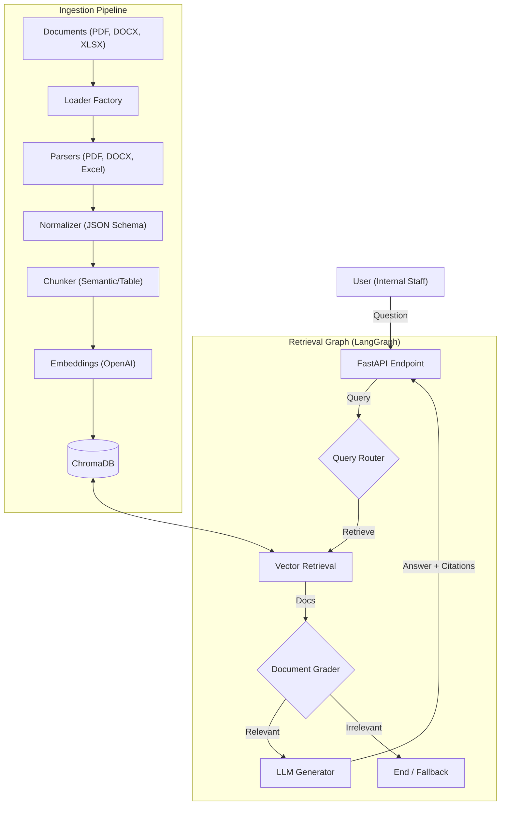

# Enterprise Healthcare RAG MVP

A secure, explainable Retrieval-Augmented Generation (RAG) system designed for healthcare policy and clinical guidelines. This system allows internal staff to ask natural-language questions and receive answers strictly grounded in uploaded documents (PDF, DOCX, Excel), with precise citations and zero hallucination tolerance.

## 🚀 Key Features

*   **Multi-Format Ingestion**: Supports PDF (Policies), DOCX (Procedures), and Excel (Coverage Tables).
*   **Intelligent Chunking**: 
    *   Semantic chunking for text documents.
    *   **Table-Aware Chunking** for Excel to preserve header context for every row.
*   **Agentic Workflow (LangGraph)**: 
    *   **Router**: Directs queries.
    *   **Grader**: Evaluates retrieved documents for relevance before generation to reduce noise.
    *   **Generator**: Produces answers with strict strict citations (e.g., `[Ref 1]`).
*   **Premium Frontend UI**:
    *   **Glassmorphism Design**: Modern, dark-mode interface with ambient lighting effects.
    *   **Drag & Drop Ingestion**: Visual upload zone for easy document indexing.
    *   **Interactive Chat**: Real-time Q&A with markdown rendering and citation highlighting.
*   **Security & Compliance**: Designed for non-PHI policy data; strictly instructs the model to abstain from medical advice.
*   **Explainability**: Every answer is cited with the source file and page/sheet number.

## 🏗️ Architecture

The system uses a Microservice-ready architecture powered by **FastAPI** and **LangGraph**.



## 🛠️ Tech Stack

*   **Frontend**: HTML5, CSS3 (Glassmorphism), Vanilla JavaScript, Marked.js
*   **Backend**: Python 3.10+, FastAPI
*   **Orchestration**: LangChain, LangGraph
*   **Vector DB**: ChromaDB
*   **LLM**: OpenAI GPT-4 Turbo
*   **Ingestion**: `pypdf`, `pandas`, `openpyxl`, `python-docx`, `unstructured`

## 🏃‍♂️ How to Run Locally

1.  **Clone the repository**
    ```bash
    git clone https://github.com/your-username/enterprise-healthcare-rag.git
    cd enterprise-healthcare-rag
    ```

2.  **Set up Environment**
    Create a `.env` file from the example:
    ```bash
    cp .env.example .env
    ```
    Add your `OPENAI_API_KEY`.

3.  **Install Dependencies**
    ```bash
    pip install -r requirements.txt
    ```

4.  **Run the Server**
    ```bash
    python main.py
    ```
    python main.py
    ```
    The Application UI will be available at `http://localhost:8000`.
    Swagger Docs are available at `http://localhost:8000/docs`.

5.  **Test via Swagger UI**
    Navigate to `http://localhost:8000/docs`.
    *   Use `/api/v1/ingest` to upload a policy PDF or coverage Excel.
    *   Use `/api/v1/query` to ask questions like "What is the policy for MRI authorization?".

## 🔒 Security & Healthcare Considerations

*   **No PHI Storage**: This system is designed for **Knowledge Base** data (policies, SOPs), not patient records. Do not upload files containing Patient Health Information (PHI).
*   **Guardrails**: The generation prompt explicitly forbids providing clinical medical advice and forces the model to admit ignorance if the data is missing.
*   **Auditability**: All chunks retain their source filename and page number, allowing full traceability of answers.

## 🔮 Future Improvements

*   **Hybrid Search**: Integrate BM25 or Splade to improve keyword retrieval for exact acronym matches (CPT codes).
*   **Frontend**: Build a React/Next.js dashboard for document management and chat.
*   **RBAC**: Implement Role-Based Access Control to restrict who can see which policy documents.
*   **Evaluation**: Integrate RAGAS for automated evaluation of retrieval precision and answer faithfulness.
