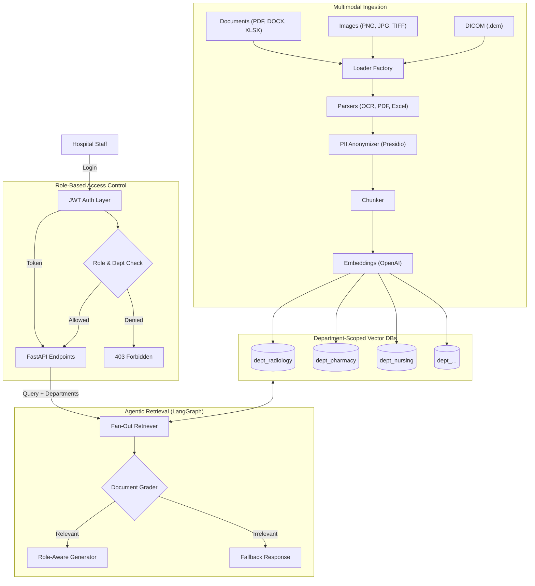

# ClinIQ — Enterprise Healthcare RAG

A secure, multimodal Retrieval-Augmented Generation (RAG) system designed for small-to-mid-size hospitals. Features **department-scoped vector databases**, **JWT-based RBAC**, **multimodal ingestion** (PDF, DOCX, Excel, Images, DICOM), and an **agentic LangGraph workflow** — all deployable as a single-container application.

## 🚀 Key Features

### 🔐 Authentication & Access Control
*   **JWT-Based Authentication**: Secure login with bcrypt-hashed passwords and token-based sessions
*   **Role Hierarchy**: `Admin` → `Doctor` → `Nurse` → `Technician` → `Researcher` → `Viewer`
*   **Department-Scoped RBAC**: Each user is assigned departments they can access — data isolation is enforced at both the API and vector DB layer
*   **Admin Panel**: Create/delete users, assign roles and departments, view system stats

### 📊 Multi-Collection Vector Store
*   **One ChromaDB collection per department**: `radiology`, `pharmacy`, `administration`, `nursing`, `laboratory`, `emergency`, `cardiology`, `oncology`, `orthopedics`, `pediatrics`, `general`
*   **Complete data isolation**: A nurse with `[nursing, general]` access can never see radiology documents
*   **Fan-out search**: Queries search across all allowed departments and merge results intelligently
*   **Configurable**: Departments are defined in `.env` — hospitals plug in their own structure

### 🖼️ Multimodal Ingestion
*   **Documents**: PDF (Policies), DOCX (Procedures), Excel (Coverage Tables)
*   **Medical Images**: OCR text extraction via Tesseract for scanned documents, X-ray reports, lab results
*   **DICOM**: Metadata extraction (study description, modality, body part, institution)
*   **Table-Aware Chunking**: Excel rows preserve header context

### 🤖 Agentic Workflow (LangGraph)
*   **Router** → **Retriever** → **Grader** → **Generator**
*   **Role-Aware Generation**: Prompts adapt based on user role (doctors get full detail, researchers get anonymized data)
*   **Hybrid Search**: Semantic (embeddings) + BM25 for better recall on medical terms/CPT codes
*   **PII Protection**: Automatic anonymization via Presidio with vault-backed de-anonymization for authorized roles

### 💎 Premium Frontend
*   **Glassmorphism dark-mode design** with ambient lighting effects
*   **Login modal** with persistent JWT sessions
*   **Department-scoped uploads**: Select target department before uploading
*   **Department filter chips**: Choose which departments to search in the chat
*   **Image preview**: Thumbnail preview for medical image uploads
*   **Admin panel**: User management and per-department document stats
*   **Responsive**: Works on desktop and tablet

## 🏗️ Architecture



## 🛠️ Tech Stack

| Layer | Technology |
|-------|-----------|
| **Frontend** | HTML5, CSS3 (Glassmorphism), Vanilla JS, Marked.js |
| **Backend** | Python 3.10+, FastAPI, Uvicorn |
| **Auth** | PyJWT, passlib (bcrypt), SQLite user store |
| **Orchestration** | LangChain, LangGraph |
| **Vector DB** | ChromaDB (multi-collection) |
| **LLM** | OpenAI GPT-4 Turbo |
| **Embeddings** | OpenAI text-embedding-3-small |
| **Search** | Hybrid (Semantic + BM25) |
| **PII** | Presidio Analyzer + Anonymizer |
| **Multimodal** | Pillow, pytesseract (OCR), pydicom |
| **Deployment** | Docker, Render |

## 🏃‍♂️ How to Run Locally

### Prerequisites
- Python 3.10+
- [Tesseract OCR](https://github.com/tesseract-ocr/tesseract) (for image text extraction)
- OpenAI API key

### Setup

1.  **Clone the repository**
    ```bash
    git clone https://github.com/your-username/enterprise-healthcare-rag.git
    cd enterprise-healthcare-rag
    ```

2.  **Set up Environment**
    ```bash
    cp .env.example .env
    ```
    Edit `.env` and add your `OPENAI_API_KEY`. Customize `HOSPITAL_DEPARTMENTS` for your hospital.

3.  **Install Dependencies**
    ```bash
    pip install -r requirements.txt
    python -m spacy download en_core_web_sm
    ```

4.  **Run the Server**
    ```bash
    python main.py
    ```
    The UI is at `http://localhost:8000`. Swagger docs at `http://localhost:8000/docs`.

5.  **Login**
    Default admin: `admin` / `admin123` (change in production!)

## 🔑 Configuration

All hospital-specific config lives in `.env`:

| Variable | Description | Default |
|----------|-------------|---------|
| `OPENAI_API_KEY` | Your OpenAI API key | required |
| `HOSPITAL_DEPARTMENTS` | Comma-separated list of departments | `radiology,pharmacy,...,general` |
| `JWT_SECRET_KEY` | Secret for JWT signing | change in prod! |
| `JWT_EXPIRY_MINUTES` | Token expiry (minutes) | `480` (8 hours) |
| `USERS_DB_PATH` | Path to SQLite user database | `./data/users.db` |
| `LLM_MODEL` | OpenAI model name | `gpt-4-turbo-preview` |

## 👥 Roles & Permissions

| Role | Access Level | Default Departments |
|------|-------------|-------------------|
| **Admin** | Full system access, user management | All |
| **Doctor** | Full clinical data, PII de-anonymization | All |
| **Nurse** | Care protocols and procedures | nursing, general, emergency |
| **Technician** | Technical procedures and safety | laboratory, radiology |
| **Researcher** | Anonymized aggregate data | general |
| **Viewer** | High-level policy summaries | general |

## 📡 API Endpoints

| Method | Endpoint | Auth | Description |
|--------|----------|------|-------------|
| POST | `/api/v1/auth/login` | ❌ | Login, returns JWT |
| POST | `/api/v1/auth/register` | Admin | Create user |
| GET | `/api/v1/auth/me` | ✅ | Current user profile |
| POST | `/api/v1/ingest` | ✅ | Upload doc to department |
| POST | `/api/v1/query` | ✅ | Query with dept filtering |
| GET | `/api/v1/departments` | ✅ | User's accessible depts |
| GET | `/api/v1/departments/stats` | Admin | Doc counts per dept |
| GET | `/api/v1/admin/users` | Admin | List all users |
| DELETE | `/api/v1/admin/users/{username}` | Admin | Delete user |

## 🔒 Security & Healthcare Considerations

*   **Department Isolation**: Vector DB collections are physically separated per department. RBAC is enforced at the API layer AND the retrieval layer.
*   **PII Protection**: All ingested text is automatically anonymized via Presidio. Only `doctor` role can de-anonymize.
*   **No PHI Storage by Design**: This system is for Knowledge Base data (policies, SOPs), not patient records.
*   **Guardrails**: Generation prompts forbid clinical medical advice and force citation-grounded answers.
*   **Audit Trail**: User IDs are passed through the retrieval graph for traceability.

## 📁 Project Structure

```
enterprise-healthcare-rag/
├── app/
│   ├── api/
│   │   └── routes.py           # Auth, ingest, query endpoints
│   ├── core/
│   │   ├── config.py           # Settings (JWT, departments, etc.)
│   │   └── limiter.py          # Rate limiting
│   ├── ingestion/
│   │   ├── chunker.py          # Text/table chunking
│   │   ├── image_parser.py     # OCR & DICOM parsing
│   │   ├── loader_factory.py   # File type routing
│   │   └── parsers.py          # PDF, DOCX, Excel parsers
│   ├── retrieval/
│   │   ├── graph.py            # LangGraph workflow
│   │   ├── state.py            # Graph state (role-aware)
│   │   ├── vector_store.py     # Multi-collection ChromaDB
│   │   └── nodes/
│   │       ├── generation.py   # Role-aware LLM generation
│   │       ├── grading.py      # Document relevance grading
│   │       └── retrieval.py    # Dept-filtered retrieval
│   ├── schemas/
│   │   └── models.py           # Pydantic models
│   └── security/
│       ├── auth.py             # JWT + user DB
│       ├── pii.py              # PII anonymization
│       ├── rbac.py             # RBAC dependencies
│       └── vault.py            # Token-to-PII vault
├── data/
│   ├── docs/                   # Source documents
│   ├── vector_db/              # ChromaDB (per-department)
│   ├── users.db                # SQLite user store
│   └── vault.db                # PII token vault
├── static/
│   ├── css/style.css
│   ├── index.html
│   └── js/script.js
├── tests/
├── main.py
├── requirements.txt
├── Dockerfile
└── .env.example
```
