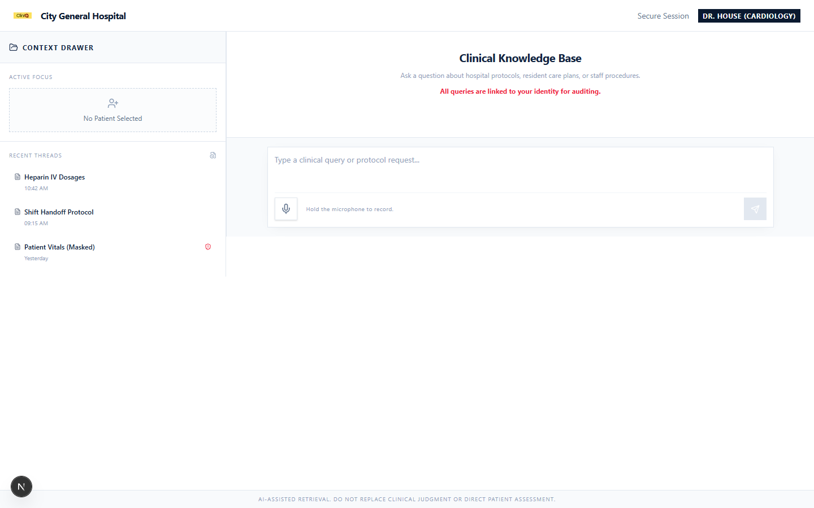
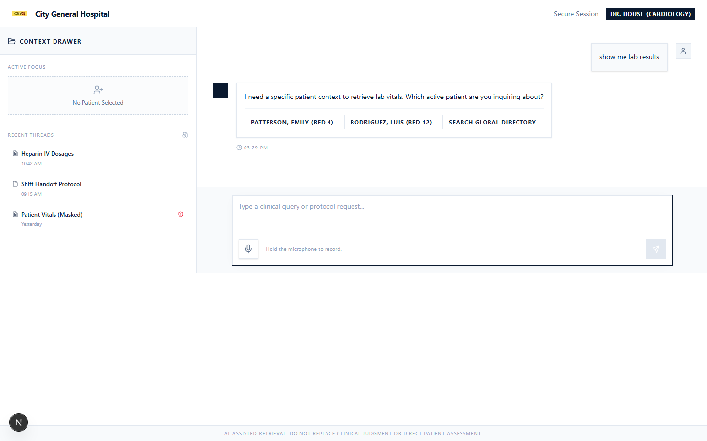
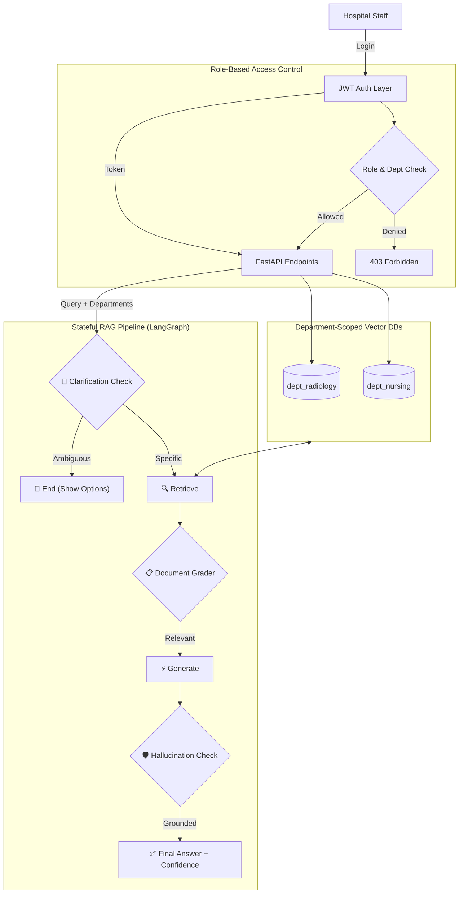

<div align="center">
  
</div>

# ClinIQ

### Enterprise Healthcare RAG & Clinical UI
A production-ready, HIPAA-compliant AI knowledge system built for velocity, safety, and scale. Designed specifically to bridge the gap between deep technical RAG orchestration and a highly polished, clinical-grade user experience for small-to-mid-size hospitals.

[Documentation](#) • [Quick Start](#quick-start) • [GitHub](https://github.com/anudeepsrib/ClinIQ)

[](#) [](#) [](#) [](#)

"When building for healthcare, 'good enough' AI is dangerous. You need absolute, verifiable control."

ClinIQ is built and maintained by [Anudeep](https://github.com/anudeepsrib).
[Website](https://github.com/anudeepsrib) • [LinkedIn](https://linkedin.com/in/anudeepsrib)

---

## Highlights

- **[Stateful RAG Pipeline](#)** — Clarification Node prevents bad answers; LLM-based Document Graders ensure relevance; automatic abbreviation expansion.
- **[Zero Hallucination Tolerance](#)** — Every answer is hard-checked against retrieved medical documents. Un-grounded responses are explicitly blocked.
- **[Inline PHI Masking](#)** — Built-in visual redaction engine hides Protected Health Information mid-sentence based on JWT role.
- **[Clinical Precision Interface](#)** — Asymmetric 80/20 Context Grid designed for noisy hospital wards and maximum context retention.
- **[Department-Scoped DBs](#)** — Strict data isolation via JWT-based Role Hierarchies (`Admin` → `Doctor` → `Nurse` → `Technician`) and ChromaDB multi-collections.

---

## Interface Overview

<div align="center">
  
  <p><em>The primary Asymmetric 80/20 Clinical Layout.</em></p>
</div>

<br/>

<div align="center">
  
  <p><em>Demonstrating dynamic mid-sentence PHI Redaction for unauthorized medical staff.</em></p>
</div>

---

## How it works (short)

```text
  React Next.js (80/20 Clinical Grid) / Web Audio Push-to-Talk
                               │
                               ▼
                ┌───────────────────────────────┐
                │          FastAPI Server       │
                │        (Authentication)       │
                └──────────────┬────────────────┘
                               │
            ├─ Dept DBs (Chroma) ├─ Auth & RBAC (JWT)
                               │
                               ▼
                ┌───────────────────────────────┐
                │        Stateful RAG           │
                │         (LangGraph)           │
                └───────────────────────────────┘
                               │
            ├─ Clarify ├─ Retrieve ├─ Grade ├─ Generate
```

## <a name="quick-start"></a> Quick Start

### 1. Start the Backend
```bash
cp .env.example .env
# Ensure OPENAI_API_KEY is configured in .env
uvicorn main:app --reload
```

### 2. Start the Frontend
```bash
cd frontend
npm install
npm run dev
```
UI available at `http://localhost:3000`.

### 3. Enterprise Deployment (AKS / Kubernetes)
ClinIQ comes with a production-ready Helm chart configured for Azure Kubernetes Service (AKS) or generic Kubernetes clusters.
```bash
# Ensure you are connected to your AKS cluster
helm install cliniq ./aks/helm/cliniq \
  --namespace cliniq \
  --create-namespace \
  -f ./aks/helm/cliniq/values.yaml
```
The Helm chart includes configurations for Horizontal Pod Autoscaling, resource quotas, non-root security contexts, and liveness/readiness probes.

---

## <a name="architecture"></a> Deep Dive: Architecture


```mermaid
graph TD
    User["Hospital Staff"] -->|Login| Auth["JWT Auth Layer"]
    Auth -->|Token| API["FastAPI Endpoints"]

    subgraph RBAC ["Role-Based Access Control"]
        Auth --> RoleCheck{"Role & Dept Check"}
        RoleCheck -->|Allowed| API
        RoleCheck -->|Denied| Reject["403 Forbidden"]
    end

    subgraph VectorDBs ["Department-Scoped Vector DBs"]
        API --> DB1[("dept_radiology")]
        API --> DB2[("dept_nursing")]
    end

    subgraph RetrievalGraph ["Stateful RAG Pipeline (LangGraph)"]
        API -->|"Query + Departments"| ClarCheck{"🤔 Clarification Check"}
        ClarCheck -->|Ambiguous| ClarEnd["🏁 End (Show Options)"]
        ClarCheck -->|Specific| Retriever["🔍 Retrieve"]
        Retriever --> Grader{"📋 Document Grader"}
        Grader -->|Relevant| Generator["⚡ Generate"]
        Generator --> HalCheck{"🛡️ Hallucination Check"}
        HalCheck -->|Grounded| Response["✅ Final Answer + Confidence"]
    end

    VectorDBs <--> Retriever
```

---

## 🛠️ Built With

- **Frontend:** React, Next.js 14, Tailwind CSS v4, Zustand
- **Backend:** Python 3.10+, FastAPI, Uvicorn
- **Orchestration:** LangChain ≥0.3, LangGraph ≥0.2
- **Vector DB:** ChromaDB ≥0.5

*Built for the future of healthcare. Designed with architectural discipline.*
