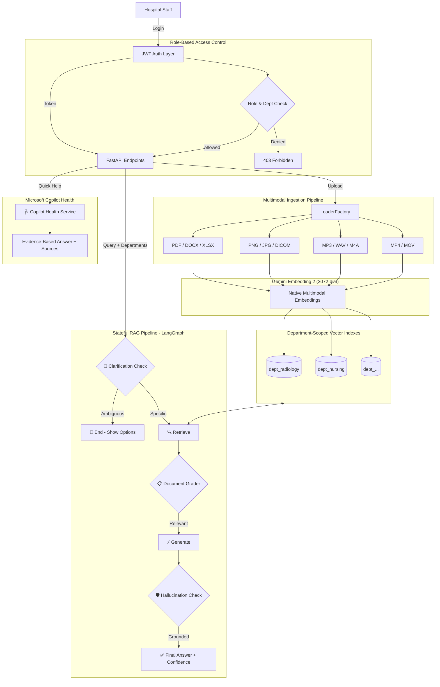

<div align="center">
  
  
  <h1 style="margin-top: 0;">ClinIQ 🏥</h1>
  
  <p><b>"When building for healthcare, 'good enough' AI is dangerous. You need absolute, verifiable control."</b></p>
  
  <p>A production-ready, HIPAA-compliant AI knowledge system built for velocity, safety, and scale — designed to bridge the gap between deep technical RAG orchestration and a clinical-grade user experience for small-to-mid-size hospitals.</p>

  <p>
    <a href="https://github.com/Anudeepsrib/ClinIQ">
      
    </a>
    <a href="https://github.com/Anudeepsrib/ClinIQ">
      
    </a>
    <a href="https://github.com/Anudeepsrib/ClinIQ/blob/main/LICENSE">
      
    </a>
    <a href="#">
      
    </a>
  </p>

  <p>
    <a href="#-the-hipaa-first-promise">Security</a> •
    <a href="#-core-features">Features</a> •
    <a href="#-quick-start">Quick Start</a> •
    <a href="#%EF%B8%8F-tech-stack">Tech Stack</a> •
    <a href="#-deep-dive-architecture">Architecture</a>
  </p>
  
  <a href="https://github.com/Anudeepsrib/ClinIQ">
    
  </a>
</div>

---

## 🔒 The HIPAA-First Promise

ClinIQ is built on the philosophy that healthcare AI must be auditable, role-scoped, and zero-hallucination tolerant. Compliance is not an afterthought — it's the foundation.

<table>
  <tr>
    <td width="50%" valign="top">
      <h3>🛡️ Role-Based Access Control</h3>
      <p>Strict JWT-based role hierarchies (<code>Admin → Doctor → Nurse → Technician</code>) enforce data boundaries at every layer. Every query is scoped to the user's department.</p>
    </td>
    <td width="50%" valign="top">
      <h3>🚫 Zero Hallucination Tolerance</h3>
      <p>Every answer is hard-checked against retrieved medical documents. Un-grounded responses are explicitly blocked — never surfaced to clinical staff.</p>
    </td>
  </tr>
  <tr>
    <td width="50%" valign="top">
      <h3>🔏 Inline PHI Masking</h3>
      <p>Built-in visual redaction engine hides Protected Health Information mid-sentence based on JWT role. Powered by Microsoft Presidio.</p>
    </td>
    <td width="50%" valign="top">
      <h3>🏢 Department-Scoped Data</h3>
      <p>Strict data isolation via Azure AI Search multi-indexes. Radiology staff never see pharmacy data. Configurable per-hospital department structure.</p>
    </td>
  </tr>
</table>

---

## ✨ Core Features

<table>
  <tr>
    <td width="33%" valign="top">
      <b>🧠 Stateful RAG Pipeline</b><br/>
      Powered by LangGraph. Clarification nodes prevent bad answers. LLM-based document graders ensure relevance. Automatic abbreviation expansion for medical terms.
    </td>
    <td width="33%" valign="top">
      <b>🌐 Multimodal RAG</b><br/>
      Gemini Embedding 2 natively embeds text, images, PDFs, audio, and video in a single 3072-dim vector space. X-rays, DICOM scans, and voice notes are searchable — no OCR middleman.
    </td>
    <td width="33%" valign="top">
      <b>🩺 Copilot Health</b><br/>
      Integrated Microsoft Copilot Health backend service gives doctors and nurses instant, evidence-based clinical intelligence without leaving the ClinIQ interface.
    </td>
  </tr>
  <tr>
    <td width="33%" valign="top">
      <b>🎨 Clinical Precision UI</b><br/>
      Asymmetric 80/20 Context Grid designed for noisy hospital wards. Maximum context retention. Dark-mode optimized for low-light environments.
    </td>
    <td width="33%" valign="top">
      <b>📊 Full Observability</b><br/>
      Deep LangSmith integration traces every graph node, LLM call, and retriever invocation. Complete audit trail for compliance reviews.
    </td>
    <td width="33%" valign="top">
      <b>☸️ Enterprise Deployment</b><br/>
      Production-ready Helm charts for AKS/Kubernetes. HPA, resource quotas, non-root security contexts, and liveness/readiness probes included.
    </td>
  </tr>
</table>

---

## 🖥️ Interface Overview

<div align="center">
  
  <p><em>The primary Asymmetric 80/20 Clinical Layout.</em></p>
</div>

<br/>

<div align="center">
  
  <p><em>Dynamic mid-sentence PHI Redaction for unauthorized medical staff.</em></p>
</div>

---

## 🚀 Quick Start

Get up and running locally in under 5 minutes.

### 1. Clone & Configure
```bash
git clone https://github.com/Anudeepsrib/ClinIQ.git
cd ClinIQ

cp .env.example .env
# Configure your API keys in .env:
#   OPENAI_API_KEY, GOOGLE_API_KEY, JWT_SECRET_KEY
```

### 2. Backend Server
```bash
pip install -r requirements.txt
uvicorn main:app --reload
```

### 3. Frontend Interface
```bash
cd frontend
npm install
npm run dev
```

Open [http://localhost:3000](http://localhost:3000) to access the clinical interface.

### 4. Enterprise Deployment (AKS / Kubernetes)
ClinIQ ships with a production-ready Helm chart for Azure Kubernetes Service or any generic K8s cluster.
```bash
helm install cliniq ./aks/helm/cliniq \
  --namespace cliniq \
  --create-namespace \
  -f ./aks/helm/cliniq/values.yaml
```

---

## 🛠️ Tech Stack

<table>
  <tr>
    <th width="50%">Frontend (Clinical Interface)</th>
    <th width="50%">Backend (RAG Engine)</th>
  </tr>
  <tr>
    <td valign="top">
      <ul>
        <li><b>Framework:</b> Next.js 16 (App Router)</li>
        <li><b>Styling:</b> Tailwind CSS v4</li>
        <li><b>State:</b> Zustand + TanStack Query</li>
        <li><b>Animation:</b> Framer Motion</li>
        <li><b>Language:</b> TypeScript</li>
      </ul>
    </td>
    <td valign="top">
      <ul>
        <li><b>API:</b> FastAPI (Python 3.10+)</li>
        <li><b>Orchestration:</b> LangChain ≥0.3 + LangGraph ≥0.2</li>
        <li><b>Embeddings:</b> Google Gemini 2 (3072-dim, multimodal)</li>
        <li><b>Vector Search:</b> Azure AI Search (hybrid: vector + BM25)</li>
        <li><b>PHI Detection:</b> Microsoft Presidio</li>
        <li><b>Observability:</b> LangSmith</li>
      </ul>
    </td>
  </tr>
</table>

---

## 🧠 Deep Dive: Architecture


```mermaid
graph TD
    User["Hospital Staff"] -->|Login| Auth["JWT Auth Layer"]
    Auth -->|Token| API["FastAPI Endpoints"]

    subgraph RBAC ["Role-Based Access Control"]
        Auth --> RoleCheck{"Role & Dept Check"}
        RoleCheck -->|Allowed| API
        RoleCheck -->|Denied| Reject["403 Forbidden"]
    end

    subgraph Ingestion ["Multimodal Ingestion Pipeline"]
        API -->|Upload| Loader["LoaderFactory"]
        Loader --> TextParser["PDF / DOCX / XLSX"]
        Loader --> ImageParser["PNG / JPG / DICOM"]
        Loader --> AudioParser["MP3 / WAV / M4A"]
        Loader --> VideoParser["MP4 / MOV"]
    end

    subgraph EmbeddingLayer ["Gemini Embedding 2 (3072-dim)"]
        TextParser --> GeminiEmb["Native Multimodal Embeddings"]
        ImageParser --> GeminiEmb
        AudioParser --> GeminiEmb
        VideoParser --> GeminiEmb
    end

    subgraph VectorDBs ["Department-Scoped Vector Indexes"]
        GeminiEmb --> DB1[("dept_radiology")]
        GeminiEmb --> DB2[("dept_nursing")]
        GeminiEmb --> DB3[("dept_... ")]
    end

    subgraph RetrievalGraph ["Stateful RAG Pipeline - LangGraph"]
        API -->|"Query + Departments"| ClarCheck{"🤔 Clarification Check"}
        ClarCheck -->|Ambiguous| ClarEnd["🏁 End - Show Options"]
        ClarCheck -->|Specific| Retriever["🔍 Retrieve"]
        Retriever --> Grader{"📋 Document Grader"}
        Grader -->|Relevant| Generator["⚡ Generate"]
        Generator --> HalCheck{"🛡️ Hallucination Check"}
        HalCheck -->|Grounded| Response["✅ Final Answer + Confidence"]
    end

    subgraph CopilotHealth ["Microsoft Copilot Health"]
        API -->|"Quick Help"| CopilotSvc["🩺 Copilot Health Service"]
        CopilotSvc --> CopilotResp["Evidence-Based Answer + Sources"]
    end

    VectorDBs <--> Retriever
```

---

## ⚙️ Configuration

Your instance can be customized entirely via the `.env` file:

```env
# AI Provider
OPENAI_API_KEY=sk-your-openai-api-key-here
LLM_MODEL=gpt-4o
EMBEDDING_MODEL=text-embedding-3-small

# Google Gemini (Multimodal Embeddings)
GOOGLE_API_KEY=your-google-api-key-here
EMBEDDING_PROVIDER=gemini
EMBEDDING_DIMENSIONS=3072

# JWT / Authentication
JWT_SECRET_KEY=change-me-in-production-use-openssl-rand-hex-32
JWT_ALGORITHM=HS256

# Hospital Config (customize per deployment)
HOSPITAL_DEPARTMENTS=radiology,pharmacy,nursing,laboratory,emergency,cardiology,oncology

# LangSmith Observability (Optional)
LANGCHAIN_TRACING_V2=true
LANGCHAIN_API_KEY=ls__your-langsmith-api-key
LANGCHAIN_PROJECT=ClinIQ-Hospital-Beta
```

---

## 🏗️ Project Structure

```text
ClinIQ/
├── app/
│   ├── api/            # FastAPI routes & Copilot Health endpoints
│   ├── chat/           # RAG pipeline & Copilot service wrapper
│   ├── core/           # Configuration, settings, constants
│   ├── ingestion/      # Multimodal document loaders & chunking
│   ├── retrieval/      # Vector search & hybrid retrieval
│   ├── schemas/        # Pydantic models & request/response types
│   ├── security/       # JWT auth, RBAC, Presidio PHI masking
│   └── observability/  # LangSmith tracing & audit logging
├── frontend/
│   └── src/            # Next.js 16 App Router (TypeScript)
├── aks/
│   └── helm/           # Production Helm charts for Kubernetes
├── data/               # Vector DB persistence & document store
├── tests/              # Unit & integration test suites
├── scripts/            # Setup & utility scripts
└── main.py             # Application entrypoint
```

---

## ⚠️ Disclaimer
**General Informational Use Only:** ClinIQ is an educational and research software project. It does **not** provide medical advice, diagnosis, or treatment protocols. Healthcare organizations deploying this system must conduct their own compliance review before clinical use. Users with specific medical conditions should consult a qualified healthcare professional.

---

<div align="center">
  <p>Built with ❤️ for healthcare teams who refuse to compromise on safety.</p>
  <p>Designed and maintained by <a href="https://github.com/anudeepsrib">Anudeep</a>.</p>
</div>
