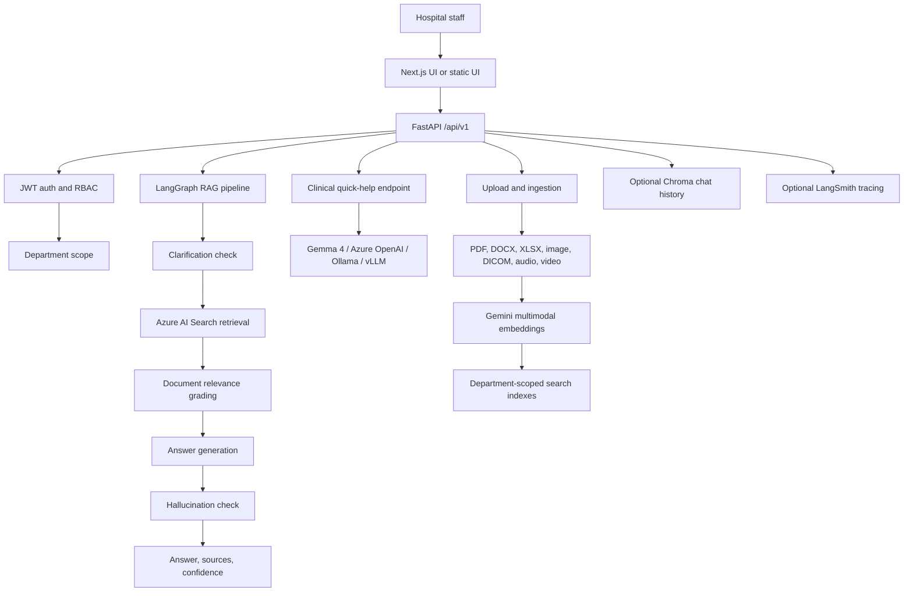

# ClinIQ

ClinIQ is a healthcare RAG demo and reference implementation for hospital policy search, role-scoped retrieval, and clinical quick-help workflows. It is designed for local experimentation and architecture review with HIPAA-aware controls, not as certified clinical or compliance software.

The app combines a FastAPI backend, a LangGraph RAG pipeline, a Next.js clinical interface, Google Gemma 4 model routing, Gemini multimodal embeddings, Azure AI Search-ready retrieval, JWT/RBAC enforcement, PHI masking, and optional LangSmith tracing.


## Contents

- [What It Does](#what-it-does)
- [Safety And Scope](#safety-and-scope)
- [Architecture](#architecture)
- [Prerequisites](#prerequisites)
- [Quick Start](#quick-start)
- [Configuration](#configuration)
- [Provider Modes](#provider-modes)
- [Working With Data](#working-with-data)
- [API Examples](#api-examples)
- [Quality Checks](#quality-checks)
- [Deployment](#deployment)
- [Troubleshooting](#troubleshooting)
- [Project Structure](#project-structure)

## What It Does

- Answers hospital policy questions through a stateful LangGraph RAG pipeline.
- Applies JWT authentication, role hierarchy checks, and department-scoped access.
- Anonymizes PHI-like values before graph/model calls, logging, tracing metadata, and chat-history storage where feasible.
- Uses clarification, relevance grading, generation, hallucination checking, and retry nodes to keep answers conservative.
- Supports hosted Google Gemma 4, Azure/OpenAI, local Ollama, and local vLLM provider modes.
- Supports multimodal ingestion paths for PDF, DOCX, XLSX, images, DICOM, audio, and video metadata/chunks.
- Includes a Next.js clinical interface plus a static fallback UI served by FastAPI.
- Ships deployment-oriented Helm templates for Kubernetes/AKS-style environments.

## Safety And Scope

ClinIQ is educational and experimental software. It does not provide medical advice, diagnosis, treatment protocols, or production HIPAA compliance by itself.

Before using real PHI or clinical workflows, an organization must complete legal review, clinical safety review, threat modeling, identity-management integration, audit-retention planning, secrets/KMS design, storage encryption, backup/restore validation, monitoring, incident response, and deployment hardening.

Security defaults are conservative:

- External tracing is disabled unless explicitly enabled.
- Demo admin seeding is disabled unless explicitly enabled.
- Runtime DBs, vector stores, temp files, API keys, and `.env` files are ignored.
- Production startup rejects weak JWT secrets and wildcard CORS with credentials.
- The generation prompt treats retrieved documents as untrusted content.

See [docs/security-hardening.md](docs/security-hardening.md) for more detail.

## Architecture


```mermaid
graph TD
    User["Hospital staff"] --> Frontend["Next.js UI or static UI"]
    Frontend --> API["FastAPI /api/v1"]
    API --> Auth["JWT auth and RBAC"]
    Auth --> Dept["Department scope"]

    API --> Graph["LangGraph RAG pipeline"]
    Graph --> Clarify["Clarification check"]
    Clarify --> Retrieve["Azure AI Search retrieval"]
    Retrieve --> Grade["Document relevance grading"]
    Grade --> Generate["Answer generation"]
    Generate --> Verify["Hallucination check"]
    Verify --> Response["Answer, sources, confidence"]

    API --> Intel["Clinical quick-help endpoint"]
    Intel --> Provider["Gemma 4 / Azure OpenAI / Ollama / vLLM"]

    API --> Ingest["Upload and ingestion"]
    Ingest --> Parse["PDF, DOCX, XLSX, image, DICOM, audio, video"]
    Parse --> Embed["Gemini multimodal embeddings"]
    Embed --> SearchIndex["Department-scoped search indexes"]

    API --> History["Optional Chroma chat history"]
    API --> Trace["Optional LangSmith tracing"]
```

The backend can start without external credentials. Real synthesis requires the selected LLM provider credentials, and real retrieval requires Azure AI Search to be enabled and configured.

## Prerequisites

- Python 3.11 recommended.
- Node.js 22 recommended for the frontend.
- `npm` for frontend dependency installation.
- Optional: Google AI Studio API key for hosted Gemma 4 and Gemini embeddings.
- Optional: Azure AI Search service and key for production retrieval.
- Optional: Ollama or vLLM running locally for local model modes.

## Quick Start

### 1. Clone And Install Backend

```bash
git clone https://github.com/Anudeepsrib/ClinIQ.git
cd ClinIQ

python -m venv .venv
```

Windows PowerShell:

```powershell
.\.venv\Scripts\Activate.ps1
python -m pip install --upgrade pip
pip install -r requirements.txt
```

macOS/Linux:

```bash
source .venv/bin/activate
python -m pip install --upgrade pip
pip install -r requirements.txt
```

### 2. Configure Backend

Windows PowerShell:

```powershell
Copy-Item .env.example .env
python -c "import secrets; print(secrets.token_urlsafe(48))"
```

macOS/Linux:

```bash
cp .env.example .env
python -c "import secrets; print(secrets.token_urlsafe(48))"
```

Paste the generated value into `JWT_SECRET_KEY` in `.env`.

For a local login account, enable the demo admin only in development:

```env
ALLOW_DEMO_ADMIN=true
DEMO_ADMIN_USERNAME=admin
DEMO_ADMIN_PASSWORD=replace-with-a-local-password-at-least-12-chars
```

For hosted Gemma 4:

```env
GOOGLE_API_KEY=your-google-api-key
LLM_PROVIDER=google_gemma
LLM_MODEL=gemma-4-26b-a4b-it
```

You can still run startup/build/test checks with API keys blank. Queries that require an unconfigured model provider will fall back conservatively instead of silently inventing answers.

### 3. Start Backend

```bash
uvicorn main:app --host 127.0.0.1 --port 8000
```

Health checks:

```bash
curl http://127.0.0.1:8000/health
curl http://127.0.0.1:8000/ready
```

Open API docs in development:

```text
http://127.0.0.1:8000/docs
```

### 4. Start Frontend

Windows PowerShell:

```powershell
cd frontend
npm install
Copy-Item .env.example .env.local
npm run dev
```

macOS/Linux:

```bash
cd frontend
npm install
cp .env.example .env.local
npm run dev
```

Open:

```text
http://localhost:3000
```

The frontend defaults to `NEXT_PUBLIC_API_URL=http://localhost:8000`.

## Configuration

The backend uses `.env` through Pydantic settings. The most important values are:

| Variable | Default | Purpose |
| --- | --- | --- |
| `ENVIRONMENT` | `development` | Enables dev docs and production validations. |
| `JWT_SECRET_KEY` | placeholder | Must be replaced. Production rejects weak values. |
| `ALLOW_DEMO_ADMIN` | `false` | Enables one local admin seed account when no users exist. |
| `GOOGLE_API_KEY` | blank | Required for hosted Gemma 4 and Gemini embeddings. |
| `OPENAI_API_KEY` | blank | Required only for `azure_openai` provider or OpenAI embeddings/chat history. |
| `LLM_PROVIDER` | `google_gemma` | One of `google_gemma`, `azure_openai`, `ollama`, `vllm`. |
| `LLM_MODEL` | `gemma-4-26b-a4b-it` | Backward-compatible model override for the configured provider. |
| `GOOGLE_GEMMA_MODEL` | `gemma-4-26b-a4b-it` | Hosted Gemma fallback when switching providers at request time. |
| `OPENAI_LLM_MODEL` | `gpt-4o` | OpenAI/Azure fallback when switching providers at request time. |
| `LOCAL_LLM_MODEL` | `gemma4:e4b` | Ollama/vLLM local model name. |
| `EMBEDDING_PROVIDER` | `gemini` | `gemini` or `openai`. |
| `EMBEDDING_MODEL` | `multimodal-embedding-002` | Embedding model name. |
| `AZURE_SEARCH_ENABLED` | `false` | Enables real Azure AI Search retrieval. |
| `CHAT_HISTORY_ENABLED` | `false` | Enables Chroma-backed chat history. |
| `ENABLE_EXTERNAL_TRACING` | `false` | Enables LangSmith export. Keep off for PHI-sensitive local work. |

Full local defaults live in [.env.example](.env.example).

## Provider Modes

| Provider | `LLM_PROVIDER` | Required setup | Notes |
| --- | --- | --- | --- |
| Hosted Gemma 4 | `google_gemma` | `GOOGLE_API_KEY` | Default hosted model path. Supports text and image inputs through Google GenAI/LangChain. |
| Azure/OpenAI | `azure_openai` | `OPENAI_API_KEY` | Uses OpenAI-compatible chat calls with `OPENAI_LLM_MODEL`. |
| Ollama | `ollama` | Local Ollama on `OLLAMA_BASE_URL` | Traffic is restricted to localhost by default. |
| vLLM | `vllm` | Local vLLM OpenAI-compatible server on `VLLM_BASE_URL` | Traffic is restricted to localhost by default. |

The UI model switcher sends the selected provider with both standard RAG queries and clinical quick-help requests.

## Working With Data

Sample documents are expected under `data/docs`, but runtime data is ignored by Git. The ingestion endpoint accepts supported document uploads and registers versions through the document registry.

For real retrieval:

1. Set `AZURE_SEARCH_ENABLED=true`.
2. Set `AZURE_SEARCH_ENDPOINT`.
3. Set `AZURE_SEARCH_API_KEY`.
4. Confirm `AZURE_SEARCH_INDEX_PREFIX`.
5. Ingest documents through `/api/v1/ingest`.

When Azure Search is disabled, ingestion and app startup still work, but retrieval returns no indexed search results.

## API Examples

### Login

```bash
curl -X POST http://127.0.0.1:8000/api/v1/auth/login \
  -H "Content-Type: application/json" \
  -d '{"username":"admin","password":"replace-with-a-local-password-at-least-12-chars"}'
```

Save the returned token:

```bash
TOKEN="paste-access-token-here"
```

### Query Documents

```bash
curl -X POST http://127.0.0.1:8000/api/v1/query \
  -H "Authorization: Bearer $TOKEN" \
  -H "Content-Type: application/json" \
  -d '{
    "question": "What is the MRI authorization policy?",
    "departments": ["radiology"],
    "provider": "google_gemma"
  }'
```

### Clinical Quick Help

```bash
curl -X POST http://127.0.0.1:8000/api/v1/copilot/quick-help \
  -H "Authorization: Bearer $TOKEN" \
  -H "Content-Type: application/json" \
  -d '{
    "question": "Summarize key safety checks before heparin administration.",
    "department": "nursing",
    "provider": "google_gemma"
  }'
```

The route keeps the `/copilot/quick-help` path for compatibility, but the implementation is now a configurable clinical intelligence provider.

### Upload A Document

```bash
curl -X POST http://127.0.0.1:8000/api/v1/ingest \
  -H "Authorization: Bearer $TOKEN" \
  -F "department=radiology" \
  -F "file=@data/docs/policy_mri_authorization.pdf"
```

## Quality Checks

Backend:

```bash
python -m ruff check app tests main.py scripts
python -m compileall app main.py tests scripts
python -m pytest
pip check
```

Frontend:

```bash
cd frontend
npm run lint
npm run build
npm audit --audit-level=high
```

Security/dependency audit:

```bash
pip-audit -r requirements.txt
```

Optional evaluation scripts live under `tests/evaluation`. They require optional RAGAS dependencies that are intentionally not part of the default runtime install.

## Deployment

### Render

`render.yaml` includes a Python web service definition. Configure runtime secrets in Render, especially:

- `JWT_SECRET_KEY`
- `GOOGLE_API_KEY` or the provider key you choose
- `ENVIRONMENT=production`
- `CORS_ALLOWED_ORIGINS`

### Kubernetes / Helm

Create secrets outside the chart:

```bash
kubectl create namespace cliniq
kubectl -n cliniq create secret generic cliniq-runtime \
  --from-literal=JWT_SECRET_KEY='<strong-random-secret>' \
  --from-literal=GOOGLE_API_KEY='<google-ai-studio-key>'
```

Install:

```bash
helm install cliniq ./aks/helm/cliniq \
  --namespace cliniq \
  --set secrets.existingSecret=cliniq-runtime \
  -f ./aks/helm/cliniq/values.yaml
```

Production deployments should replace `emptyDir` data volumes with durable storage where needed and provide secrets through a managed secret system such as Azure Key Vault CSI Driver, External Secrets Operator, sealed-secrets, or equivalent.

## Troubleshooting

| Symptom | Likely cause | Fix |
| --- | --- | --- |
| `401 Authentication required` | Missing JWT token | Login and pass `Authorization: Bearer <token>`. |
| No users can log in locally | Demo admin is disabled | Set `ALLOW_DEMO_ADMIN=true` and a 12+ char `DEMO_ADMIN_PASSWORD`, then start with an empty users DB. |
| Conservative extractive answer | Selected provider key is missing | Set `GOOGLE_API_KEY`, `OPENAI_API_KEY`, or switch to a running local provider. |
| No retrieved sources | Azure Search disabled or empty | Enable/configure Azure Search and ingest documents. |
| CORS errors in browser | Frontend origin not allowed | Add the frontend URL to `CORS_ALLOWED_ORIGINS`. |
| Production startup rejects config | Weak secret or unsafe CORS/demo admin | Use a strong `JWT_SECRET_KEY`, no wildcard CORS with credentials, and disable demo admin. |
| Ollama/vLLM calls fail | Local server not running or non-localhost URL | Start the local model server and keep `OLLAMA_BASE_URL`/`VLLM_BASE_URL` on localhost. |
| LangSmith traces missing | External tracing disabled | Set `ENABLE_EXTERNAL_TRACING=true` and provide `LANGCHAIN_API_KEY` only if PHI egress is approved. |

## Project Structure

```text
ClinIQ/
├── app/
│   ├── api/            # FastAPI routes
│   ├── chat/           # Provider adapters, local LLM adapter, chat history
│   ├── core/           # Settings, logging, rate limiting
│   ├── ingestion/      # Loaders, parsers, chunking, upsert pipeline
│   ├── observability/  # LangSmith tracing helpers
│   ├── retrieval/      # Azure Search store and LangGraph nodes
│   ├── schemas/        # Pydantic request/response models
│   └── security/       # Auth, RBAC, PHI masking, upload validation
├── aks/helm/cliniq/    # Kubernetes chart
├── data/               # Local runtime data, ignored by Git
├── demo-automation/    # Demo screenshot automation
├── docs/               # Security and design notes
├── frontend/           # Next.js clinical interface
├── scripts/            # Utility/data generation scripts
├── static/             # Static fallback UI served by FastAPI
├── tests/              # Unit and integration tests
├── main.py             # FastAPI application entrypoint
└── requirements.txt    # Backend runtime dependencies
```

## License

See [LICENSE](LICENSE).
