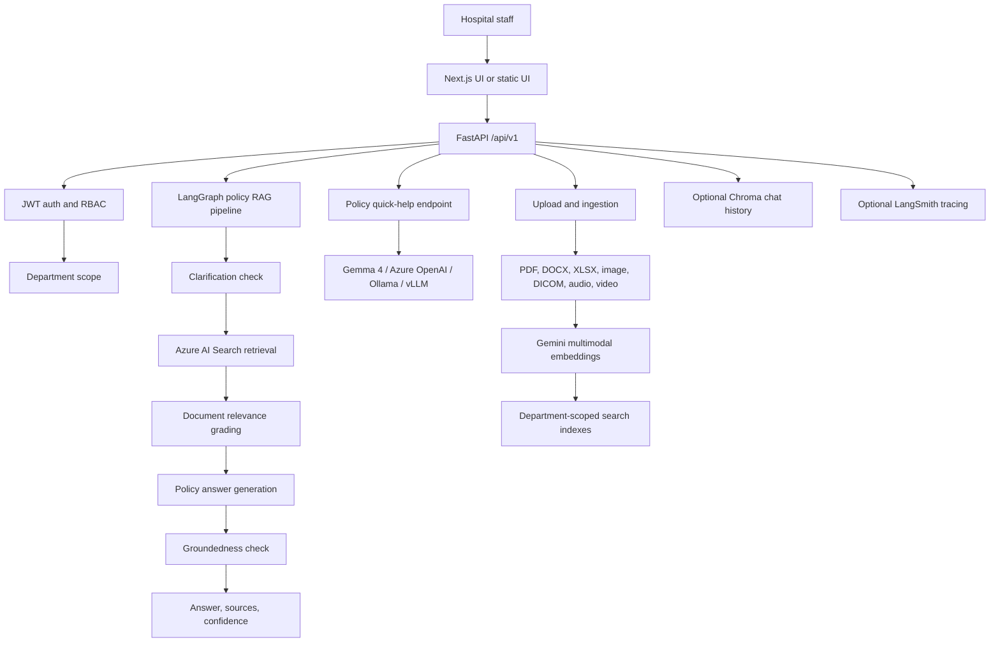
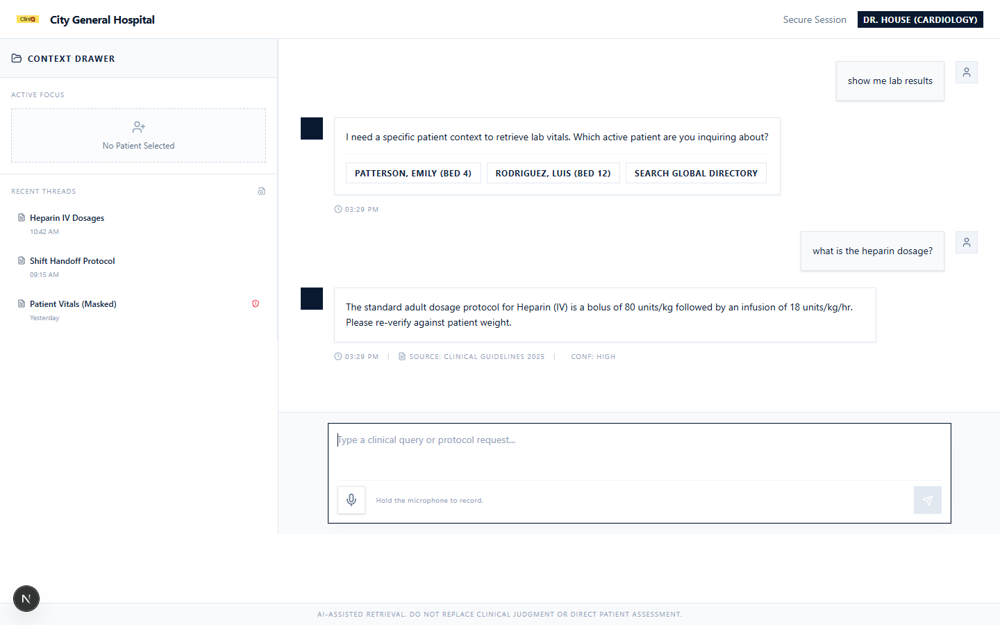

# ClinIQ

ClinIQ is a focused hospital policy RAG reference app. It helps hospital staff ask role-scoped questions against institutional policy, procedure, coverage, and administrative documents, then returns conservative answers with source context.

ClinIQ is intentionally narrower than CareOS. CareOS can remain the broader care operations or healthcare platform story; ClinIQ is the policy retrieval and evaluation reference app that demonstrates how hospital knowledge can be searched, cited, masked, and tested.

ClinIQ is not certified clinical, compliance, or HIPAA software. The controls in this repository are implementation patterns for local experimentation, demos, architecture review, and evaluation design.


## Contents

- [What ClinIQ Is](#what-cliniq-is)
- [ClinIQ Vs CareOS](#cliniq-vs-careos)
- [What It Does](#what-it-does)
- [Safety And Scope](#safety-and-scope)
- [Architecture](#architecture)
- [Evaluation Pack](#evaluation-pack)
- [Persona Demo](#persona-demo)
- [Screenshots](#screenshots)
- [Prerequisites](#prerequisites)
- [Quick Start](#quick-start)
- [Configuration](#configuration)
- [Provider Modes](#provider-modes)
- [Working With Data](#working-with-data)
- [API Examples](#api-examples)
- [Quality Checks](#quality-checks)
- [Deployment](#deployment)
- [Troubleshooting](#troubleshooting)
- [Project Structure](#project-structure)

## What ClinIQ Is

ClinIQ is a reference implementation for a bounded RAG product:

- Product scope: hospital policy and administrative reference.
- Primary users: nurse, administrator, compliance reviewer, and other authenticated staff.
- Knowledge scope: institutional documents that have been ingested into department-scoped indexes.
- Answer style: source-backed, conservative, and clear about missing evidence.
- Evaluation scope: synthetic policy corpus, retrieval test dataset, groundedness checks, RBAC matrix, and PHI masking examples.

Non-goals:

- It is not a care management platform.
- It is not an EHR, patient charting workflow, case management system, or care coordination layer.
- It does not provide diagnosis, treatment instructions, medical advice, or clinical decision support certification.
- It does not make a deployment HIPAA-compliant by itself.

## ClinIQ Vs CareOS

| Dimension | ClinIQ | CareOS |
| --- | --- | --- |
| Product role | Focused hospital policy RAG reference app | Broader care operations or healthcare platform |
| Primary job | Retrieve and summarize institutional policy documents with citations | Coordinate workflows, patients, tasks, care programs, or operations |
| Knowledge boundary | Ingested hospital policies, SOPs, coverage tables, and administrative rules | Potentially many operational, clinical, financial, and patient-context systems |
| User experience | Ask a policy question, choose department scope, review cited answer | Manage end-to-end care or operational workflows |
| Risk posture | Demonstrates RBAC, PHI masking, grounding, and evaluation patterns | Would need broader product, workflow, safety, integration, and compliance governance |
| Success metric | Retrieval hit rate, groundedness, source coverage, RBAC enforcement, PHI masking | Operational outcomes, workflow completion, care team coordination, program KPIs |
| Compliance claim | HIPAA-aware implementation patterns only | Any compliance posture must be separately defined and validated |

See [docs/cliniq-vs-careos.md](docs/cliniq-vs-careos.md) for the fuller positioning note.

## What It Does

- Answers hospital policy questions through a stateful LangGraph RAG pipeline.
- Applies JWT authentication, role hierarchy checks, and department-scoped access.
- Anonymizes PHI-like values before graph/model calls, logging, tracing metadata, and chat-history storage where feasible.
- Uses clarification, relevance grading, generation, hallucination checking, and retry nodes to keep answers conservative.
- Supports hosted Google Gemma 4, Azure/OpenAI, local Ollama, and local vLLM provider modes.
- Supports multimodal ingestion paths for PDF, DOCX, XLSX, images, DICOM, audio, and video metadata/chunks.
- Includes a Next.js policy reference interface plus a static fallback UI served by FastAPI.
- Ships Helm templates that can be adapted for Kubernetes or AKS-style evaluation environments.

## Safety And Scope

ClinIQ is educational and experimental software. It does not provide medical advice, diagnosis, treatment protocols, legal advice, or production compliance by itself.

Before using real PHI or live hospital workflows, an organization must complete legal review, clinical safety review, threat modeling, identity-management integration, audit-retention planning, secrets/KMS design, storage encryption, backup/restore validation, monitoring, incident response, and deployment hardening.

Security defaults are conservative:

- External tracing is disabled unless explicitly enabled.
- Demo admin seeding is disabled unless explicitly enabled.
- Runtime DBs, vector stores, temp files, API keys, and `.env` files are ignored.
- Production startup rejects weak JWT secrets and wildcard CORS with credentials.
- The generation prompt treats retrieved documents as untrusted content.
- The app fails closed when it cannot verify groundedness.

See [docs/security-hardening.md](docs/security-hardening.md) for more detail.

## Architecture


```mermaid
graph TD
    User["Hospital staff"] --> Frontend["Next.js UI or static UI"]
    Frontend --> API["FastAPI /api/v1"]
    API --> Auth["JWT auth and RBAC"]
    Auth --> Dept["Department scope"]

    API --> Graph["LangGraph policy RAG pipeline"]
    Graph --> Clarify["Clarification check"]
    Clarify --> Retrieve["Azure AI Search retrieval"]
    Retrieve --> Grade["Document relevance grading"]
    Grade --> Generate["Policy answer generation"]
    Generate --> Verify["Groundedness check"]
    Verify --> Response["Answer, sources, confidence"]

    API --> QuickHelp["Policy quick-help endpoint"]
    QuickHelp --> Provider["Gemma 4 / Azure OpenAI / Ollama / vLLM"]

    API --> Ingest["Upload and ingestion"]
    Ingest --> Parse["PDF, DOCX, XLSX, image, DICOM, audio, video"]
    Parse --> Embed["Gemini multimodal embeddings"]
    Embed --> SearchIndex["Department-scoped search indexes"]

    API --> History["Optional Chroma chat history"]
    API --> Trace["Optional LangSmith tracing"]
```

The backend can start without external credentials. Real synthesis requires the selected LLM provider credentials, and real retrieval requires Azure AI Search to be enabled and configured.

Architecture notes live in [docs/architecture-notes.md](docs/architecture-notes.md).

## Evaluation Pack

The repo includes a synthetic policy evaluation pack under [tests/evaluation](tests/evaluation):

| Artifact | Purpose |
| --- | --- |
| [tests/evaluation/policy_corpus](tests/evaluation/policy_corpus) | Synthetic hospital policy corpus for nursing, administration, compliance, and radiology examples. |
| [tests/evaluation/retrieval_eval_dataset.jsonl](tests/evaluation/retrieval_eval_dataset.jsonl) | Retrieval questions with personas, allowed departments, expected documents, expected terms, and unsupported-answer traps. |
| [tests/evaluation/rbac_test_matrix.json](tests/evaluation/rbac_test_matrix.json) | Role and department matrix for nurse, admin, and compliance reviewer personas. |
| [tests/evaluation/phi_masking_examples.json](tests/evaluation/phi_masking_examples.json) | PHI masking examples for names, phones, emails, SSNs, and preservation of non-PHI policy text. |
| [tests/evaluation/README.md](tests/evaluation/README.md) | How to use the evaluation fixtures and what each artifact proves. |

Regression tests validate the artifacts and core controls:

- [tests/test_policy_eval_artifacts.py](tests/test_policy_eval_artifacts.py)
- [tests/test_rag_safety.py](tests/test_rag_safety.py)
- [tests/test_rbac_matrix.py](tests/test_rbac_matrix.py)
- [tests/test_phi_masking_examples.py](tests/test_phi_masking_examples.py)

## Persona Demo

The persona script in [docs/demo-script.md](docs/demo-script.md) walks through three focused demos:

- Nurse: asks for isolation and hand-hygiene policy steps from the nursing corpus.
- Admin: reviews policy lifecycle, emergency approval, and department stats.
- Compliance reviewer: checks minimum necessary disclosure, PHI masking, and audit-oriented access.

The script is designed for a portfolio walkthrough or evaluator review. It uses synthetic policy examples and avoids live patient data.

## Screenshots

Existing screenshots live in [frontend/public/assets](frontend/public/assets):




The screenshot guide in [docs/screenshots.md](docs/screenshots.md) explains the product story each image should support.

## Prerequisites

- Python 3.11 recommended.
- Node.js 22 recommended for the frontend.
- `npm` for frontend dependency installation.
- Optional: Google AI Studio API key for hosted Gemma 4 and Gemini embeddings.
- Optional: Azure AI Search service and key for retrieval evaluation with a real index.
- Optional: Ollama or vLLM running locally for local model modes.

## Quick Start

### 1. Clone And Install Backend

```bash
git clone https://github.com/Anudeepsrib/ClinIQ.git
cd ClinIQ

python -m venv .venv
```

Windows PowerShell:

```powershell
.\.venv\Scripts\Activate.ps1
python -m pip install --upgrade pip
pip install -r requirements.txt
```

macOS/Linux:

```bash
source .venv/bin/activate
python -m pip install --upgrade pip
pip install -r requirements.txt
```

### 2. Configure Backend

Windows PowerShell:

```powershell
Copy-Item .env.example .env
python -c "import secrets; print(secrets.token_urlsafe(48))"
```

macOS/Linux:

```bash
cp .env.example .env
python -c "import secrets; print(secrets.token_urlsafe(48))"
```

Paste the generated value into `JWT_SECRET_KEY` in `.env`.

For a local login account, enable the demo admin only in development:

```env
ALLOW_DEMO_ADMIN=true
DEMO_ADMIN_USERNAME=admin
DEMO_ADMIN_PASSWORD=replace-with-a-local-password-at-least-12-chars
```

For hosted Gemma 4:

```env
GOOGLE_API_KEY=your-google-api-key
LLM_PROVIDER=google_gemma
LLM_MODEL=gemma-4-26b-a4b-it
```

You can still run startup/build/test checks with API keys blank. Queries that require an unconfigured model provider will fall back conservatively instead of silently inventing answers.

### 3. Start Backend

```bash
uvicorn main:app --host 127.0.0.1 --port 8000
```

Health checks:

```bash
curl http://127.0.0.1:8000/health
curl http://127.0.0.1:8000/ready
```

Open API docs in development:

```text
http://127.0.0.1:8000/docs
```

### 4. Start Frontend

Windows PowerShell:

```powershell
cd frontend
npm install
Copy-Item .env.example .env.local
npm run dev
```

macOS/Linux:

```bash
cd frontend
npm install
cp .env.example .env.local
npm run dev
```

Open:

```text
http://localhost:3000
```

The frontend defaults to `NEXT_PUBLIC_API_URL=http://localhost:8000`.

## Configuration

The backend uses `.env` through Pydantic settings. The most important values are:

| Variable | Default | Purpose |
| --- | --- | --- |
| `ENVIRONMENT` | `development` | Enables dev docs and production validations. |
| `JWT_SECRET_KEY` | placeholder | Must be replaced. Production rejects weak values. |
| `ALLOW_DEMO_ADMIN` | `false` | Enables one local admin seed account when no users exist. |
| `GOOGLE_API_KEY` | blank | Required for hosted Gemma 4 and Gemini embeddings. |
| `OPENAI_API_KEY` | blank | Required only for `azure_openai` provider or OpenAI embeddings/chat history. |
| `LLM_PROVIDER` | `google_gemma` | One of `google_gemma`, `azure_openai`, `ollama`, `vllm`. |
| `LLM_MODEL` | `gemma-4-26b-a4b-it` | Backward-compatible model override for the configured provider. |
| `GOOGLE_GEMMA_MODEL` | `gemma-4-26b-a4b-it` | Hosted Gemma fallback when switching providers at request time. |
| `OPENAI_LLM_MODEL` | `gpt-4o` | OpenAI/Azure fallback when switching providers at request time. |
| `LOCAL_LLM_MODEL` | `gemma4:e4b` | Ollama/vLLM local model name. |
| `EMBEDDING_PROVIDER` | `gemini` | `gemini` or `openai`. |
| `EMBEDDING_MODEL` | `multimodal-embedding-002` | Embedding model name. |
| `AZURE_SEARCH_ENABLED` | `false` | Enables real Azure AI Search retrieval. |
| `CHAT_HISTORY_ENABLED` | `false` | Enables Chroma-backed chat history. |
| `ENABLE_EXTERNAL_TRACING` | `false` | Enables LangSmith export. Keep off for PHI-sensitive local work. |

Full local defaults live in [.env.example](.env.example).

## Provider Modes

| Provider | `LLM_PROVIDER` | Required setup | Notes |
| --- | --- | --- | --- |
| Hosted Gemma 4 | `google_gemma` | `GOOGLE_API_KEY` | Default hosted model path. Supports text and image inputs through Google GenAI/LangChain. |
| Azure/OpenAI | `azure_openai` | `OPENAI_API_KEY` | Uses OpenAI-compatible chat calls with `OPENAI_LLM_MODEL`. |
| Ollama | `ollama` | Local Ollama on `OLLAMA_BASE_URL` | Traffic is restricted to localhost by default. |
| vLLM | `vllm` | Local vLLM OpenAI-compatible server on `VLLM_BASE_URL` | Traffic is restricted to localhost by default. |

The UI model switcher sends the selected provider with both standard RAG queries and policy quick-help requests.

## Working With Data

Sample runtime documents are expected under `data/docs`, but runtime data is ignored by Git. The committed synthetic evaluation corpus lives under `tests/evaluation/policy_corpus`.

For real retrieval:

1. Set `AZURE_SEARCH_ENABLED=true`.
2. Set `AZURE_SEARCH_ENDPOINT`.
3. Set `AZURE_SEARCH_API_KEY`.
4. Confirm `AZURE_SEARCH_INDEX_PREFIX`.
5. Ingest documents through `/api/v1/ingest`.

When Azure Search is disabled, ingestion and app startup still work, but retrieval returns no indexed search results.

## API Examples

### Login

```bash
curl -X POST http://127.0.0.1:8000/api/v1/auth/login \
  -H "Content-Type: application/json" \
  -d '{"username":"admin","password":"replace-with-a-local-password-at-least-12-chars"}'
```

Save the returned token:

```bash
TOKEN="paste-access-token-here"
```

### Query Documents

```bash
curl -X POST http://127.0.0.1:8000/api/v1/query \
  -H "Authorization: Bearer $TOKEN" \
  -H "Content-Type: application/json" \
  -d '{
    "question": "What approval is required before an emergency policy exception?",
    "departments": ["administration"],
    "provider": "google_gemma"
  }'
```

### Policy Quick Help

```bash
curl -X POST http://127.0.0.1:8000/api/v1/copilot/quick-help \
  -H "Authorization: Bearer $TOKEN" \
  -H "Content-Type: application/json" \
  -d '{
    "question": "Summarize the hand hygiene policy for an isolation room entry.",
    "department": "nursing",
    "provider": "google_gemma"
  }'
```

The route keeps the `/copilot/quick-help` path for compatibility, but the implementation is scoped as configurable policy reference help.

### Upload A Document

```bash
curl -X POST http://127.0.0.1:8000/api/v1/ingest \
  -H "Authorization: Bearer $TOKEN" \
  -F "department=radiology" \
  -F "file=@data/docs/policy_mri_authorization.pdf"
```

## Quality Checks

Backend:

```bash
python -m ruff check app tests main.py scripts
python -m compileall app main.py tests scripts
python -m pytest
pip check
```

Frontend:

```bash
cd frontend
npm run lint
npm run build
npm audit --audit-level=high
```

Security/dependency audit:

```bash
pip-audit -r requirements.txt
```

Optional RAGAS evaluation scripts live under `tests/evaluation`. They require optional RAGAS dependencies that are intentionally not part of the default runtime install.

## Deployment

### Render

`render.yaml` includes a Python web service definition for evaluation or demo environments. Configure runtime secrets in Render, especially:

- `JWT_SECRET_KEY`
- `GOOGLE_API_KEY` or the provider key you choose
- `ENVIRONMENT=production`
- `CORS_ALLOWED_ORIGINS`

### Kubernetes / Helm

Create secrets outside the chart:

```bash
kubectl create namespace cliniq
kubectl -n cliniq create secret generic cliniq-runtime \
  --from-literal=JWT_SECRET_KEY='<strong-random-secret>' \
  --from-literal=GOOGLE_API_KEY='<google-ai-studio-key>'
```

Install:

```bash
helm install cliniq ./aks/helm/cliniq \
  --namespace cliniq \
  --set secrets.existingSecret=cliniq-runtime \
  -f ./aks/helm/cliniq/values.yaml
```

Production deployments should replace `emptyDir` data volumes with durable storage where needed and provide secrets through a managed secret system such as Azure Key Vault CSI Driver, External Secrets Operator, sealed-secrets, or equivalent.

## Troubleshooting

| Symptom | Likely cause | Fix |
| --- | --- | --- |
| `401 Authentication required` | Missing JWT token | Login and pass `Authorization: Bearer <token>`. |
| No users can log in locally | Demo admin is disabled | Set `ALLOW_DEMO_ADMIN=true` and a 12+ char `DEMO_ADMIN_PASSWORD`, then start with an empty users DB. |
| Conservative extractive answer | Selected provider key is missing | Set `GOOGLE_API_KEY`, `OPENAI_API_KEY`, or switch to a running local provider. |
| No retrieved sources | Azure Search disabled or empty | Enable/configure Azure Search and ingest documents. |
| CORS errors in browser | Frontend origin not allowed | Add the frontend URL to `CORS_ALLOWED_ORIGINS`. |
| Production startup rejects config | Weak secret or unsafe CORS/demo admin | Use a strong `JWT_SECRET_KEY`, no wildcard CORS with credentials, and disable demo admin. |
| Ollama/vLLM calls fail | Local server not running or non-localhost URL | Start the local model server and keep `OLLAMA_BASE_URL`/`VLLM_BASE_URL` on localhost. |
| LangSmith traces missing | External tracing disabled | Set `ENABLE_EXTERNAL_TRACING=true` and provide `LANGCHAIN_API_KEY` only if PHI egress is approved. |

## Project Structure

```text
ClinIQ/
├── app/
│   ├── api/            # FastAPI routes
│   ├── chat/           # Provider adapters, local LLM adapter, chat history
│   ├── core/           # Settings, logging, rate limiting
│   ├── ingestion/      # Loaders, parsers, chunking, upsert pipeline
│   ├── observability/  # LangSmith tracing helpers
│   ├── retrieval/      # Azure Search store and LangGraph nodes
│   ├── schemas/        # Pydantic request/response models
│   └── security/       # Auth, RBAC, PHI masking, upload validation
├── aks/helm/cliniq/    # Kubernetes chart
├── data/               # Local runtime data, ignored by Git
├── demo-automation/    # Demo screenshot automation
├── docs/               # Architecture, positioning, security, screenshots, demo notes
├── frontend/           # Next.js policy reference interface
├── scripts/            # Utility/data generation scripts
├── static/             # Static fallback UI served by FastAPI
├── tests/              # Unit, integration, and evaluation artifact tests
├── main.py             # FastAPI application entrypoint
└── requirements.txt    # Backend runtime dependencies
```

## License

See [LICENSE](LICENSE).
