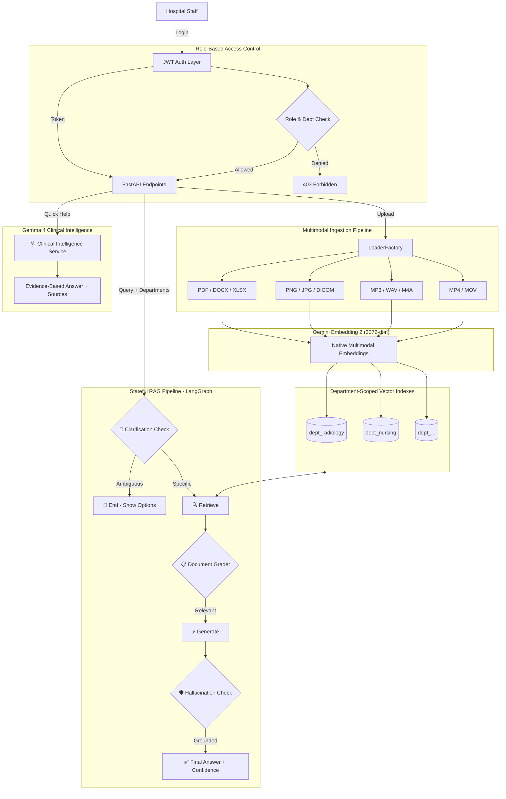

<div align="center">
  
  
  <h1 style="margin-top: 0;">ClinIQ 🏥</h1>
  
  <p><b>"When building for healthcare, 'good enough' AI is dangerous. You need absolute, verifiable control."</b></p>
  
  <p>A healthcare RAG demo and reference implementation with HIPAA-aware controls for safer local experimentation. Formal HIPAA compliance requires an organization-specific legal, security, and operational review.</p>

  <p>
    <a href="https://github.com/Anudeepsrib/ClinIQ">
      
    </a>
    <a href="https://github.com/Anudeepsrib/ClinIQ">
      
    </a>
    <a href="https://github.com/Anudeepsrib/ClinIQ/blob/main/LICENSE">
      
    </a>
    <a href="#">
      
    </a>
  </p>

  <p>
    <a href="#-security-posture">Security</a> •
    <a href="#-core-features">Features</a> •
    <a href="#-quick-start">Quick Start</a> •
    <a href="#%EF%B8%8F-tech-stack">Tech Stack</a> •
    <a href="#-deep-dive-architecture">Architecture</a>
  </p>
  
  <a href="https://github.com/Anudeepsrib/ClinIQ">
    
  </a>
</div>

---

## 🔒 Security Posture

ClinIQ is built on the philosophy that healthcare AI should be auditable, role-scoped, and conservative when context is missing. This repository implements HIPAA-aware controls, but it is not certified HIPAA-compliant production software.

<table>
  <tr>
    <td width="50%" valign="top">
      <h3>🛡️ Role-Based Access Control</h3>
      <p>Strict JWT-based role hierarchies (<code>Admin → Doctor → Nurse → Technician</code>) enforce data boundaries at every layer. Every query is scoped to the user's department.</p>
    </td>
    <td width="50%" valign="top">
      <h3>🚫 Grounding Checks</h3>
      <p>Answers are checked against retrieved documents where an LLM verifier is configured. Verification failures return conservative responses.</p>
    </td>
  </tr>
  <tr>
    <td width="50%" valign="top">
      <h3>🔏 PHI Masking</h3>
      <p>PHI-like values are anonymized before ingestion, logs, tracing metadata, and model calls where feasible. Powered by Microsoft Presidio with regex fallback.</p>
    </td>
    <td width="50%" valign="top">
      <h3>🏢 Department-Scoped Data</h3>
      <p>Department filters scope retrieval and document access. Production deployments should validate index-level isolation and operational controls.</p>
    </td>
  </tr>
</table>

---

## ✨ Core Features

<table>
  <tr>
    <td width="33%" valign="top">
      <b>🧠 Stateful RAG Pipeline</b><br/>
      Powered by LangGraph. Clarification nodes prevent bad answers. LLM-based document graders ensure relevance. Automatic abbreviation expansion for medical terms.
    </td>
    <td width="33%" valign="top">
      <b>🌐 Multimodal RAG</b><br/>
      Gemini Embedding 2 natively embeds text, images, PDFs, audio, and video in a single 3072-dim vector space. X-rays, DICOM scans, and voice notes are searchable — no OCR middleman.
    </td>
    <td width="33%" valign="top">
      <b>🩺 Gemma 4 Clinical Intelligence</b><br/>
      Hosted Google Gemma 4 gives doctors and nurses instant, evidence-based clinical intelligence without leaving the ClinIQ interface.
    </td>
  </tr>
  <tr>
    <td width="33%" valign="top">
      <b>🎨 Clinical Precision UI</b><br/>
      Asymmetric 80/20 Context Grid designed for noisy hospital wards. Maximum context retention. Dark-mode optimized for low-light environments.
    </td>
    <td width="33%" valign="top">
      <b>📊 Full Observability</b><br/>
      Optional LangSmith integration can trace graph nodes, LLM calls, and retriever invocations. External tracing is disabled by default to avoid PHI egress.
    </td>
    <td width="33%" valign="top">
      <b>☸️ Enterprise Deployment</b><br/>
      Deployment-oriented Helm charts for AKS/Kubernetes. HPA, resource quotas, non-root security contexts, and liveness/readiness probes included.
    </td>
  </tr>
</table>

---

## 🖥️ Interface Overview

<div align="center">
  
  <p><em>The primary Asymmetric 80/20 Clinical Layout.</em></p>
</div>

<br/>

<div align="center">
  
  <p><em>Dynamic mid-sentence PHI Redaction for unauthorized medical staff.</em></p>
</div>

---

## 🚀 Quick Start

ClinIQ can start locally without real API keys. Hosted Gemma 4 synthesis requires `GOOGLE_API_KEY`; external vector search requires provider credentials.

### 1. Clone
```bash
git clone https://github.com/Anudeepsrib/ClinIQ.git
cd ClinIQ
```

### 2. Create a Python environment
```bash
python -m venv .venv
# Windows PowerShell
.\.venv\Scripts\Activate.ps1
# macOS/Linux
source .venv/bin/activate

python -m pip install --upgrade pip
pip install -r requirements.txt
```

### 3. Configure local environment
```bash
cp .env.example .env
python -c "import secrets; print(secrets.token_urlsafe(48))"
```

Paste the generated value into `JWT_SECRET_KEY` in `.env`. Leave external API keys and `ENABLE_EXTERNAL_TRACING=false` blank/off unless you intentionally want to call those services.

To create a local demo admin, set `ALLOW_DEMO_ADMIN=true` and choose a unique `DEMO_ADMIN_PASSWORD` of at least 12 characters. Do not use the demo admin option in production.

### 4. Backend server
```bash
uvicorn main:app --host 127.0.0.1 --port 8000
```

Health checks:
```bash
curl http://127.0.0.1:8000/health
curl http://127.0.0.1:8000/ready
```

### 5. Frontend interface
```bash
cd frontend
npm install
cp .env.example .env.local
npm run dev
```

Open [http://localhost:3000](http://localhost:3000) to access the clinical interface.

### 6. Tests and checks
```bash
python -m compileall .
pip check
pytest

cd frontend
npm run lint
npm run build
npm audit
```

### 7. Kubernetes deployment
ClinIQ ships with a Helm chart for Azure Kubernetes Service or any generic K8s cluster. Create runtime secrets outside the chart, for example with Azure Key Vault CSI Driver, External Secrets Operator, or a manually managed Kubernetes Secret.
```bash
kubectl create namespace cliniq
kubectl -n cliniq create secret generic cliniq-runtime \
  --from-literal=JWT_SECRET_KEY='<strong-random-secret>' \
  --from-literal=GOOGLE_API_KEY='<google-ai-studio-key>'

helm install cliniq ./aks/helm/cliniq \
  --namespace cliniq \
  --set secrets.existingSecret=cliniq-runtime \
  -f ./aks/helm/cliniq/values.yaml
```

---

## 🛠️ Tech Stack

<table>
  <tr>
    <th width="50%">Frontend (Clinical Interface)</th>
    <th width="50%">Backend (RAG Engine)</th>
  </tr>
  <tr>
    <td valign="top">
      <ul>
        <li><b>Framework:</b> Next.js 16 (App Router)</li>
        <li><b>Styling:</b> Tailwind CSS v4</li>
        <li><b>State:</b> Zustand + TanStack Query</li>
        <li><b>Animation:</b> Framer Motion</li>
        <li><b>Language:</b> TypeScript</li>
      </ul>
    </td>
    <td valign="top">
      <ul>
        <li><b>API:</b> FastAPI (Python 3.10+)</li>
        <li><b>Orchestration:</b> LangChain ≥0.3 + LangGraph ≥0.2</li>
        <li><b>LLM:</b> Google Gemma 4 via the Gemini API by default</li>
        <li><b>Embeddings:</b> Google Gemini 2 (3072-dim, multimodal)</li>
        <li><b>Vector Search:</b> Azure AI Search (hybrid: vector + BM25)</li>
        <li><b>PHI Detection:</b> Microsoft Presidio</li>
        <li><b>Observability:</b> Optional LangSmith, disabled by default</li>
      </ul>
    </td>
  </tr>
</table>

---

## 🧠 Deep Dive: Architecture


```mermaid
graph TD
    User["Hospital Staff"] -->|Login| Auth["JWT Auth Layer"]
    Auth -->|Token| API["FastAPI Endpoints"]

    subgraph RBAC ["Role-Based Access Control"]
        Auth --> RoleCheck{"Role & Dept Check"}
        RoleCheck -->|Allowed| API
        RoleCheck -->|Denied| Reject["403 Forbidden"]
    end

    subgraph Ingestion ["Multimodal Ingestion Pipeline"]
        API -->|Upload| Loader["LoaderFactory"]
        Loader --> TextParser["PDF / DOCX / XLSX"]
        Loader --> ImageParser["PNG / JPG / DICOM"]
        Loader --> AudioParser["MP3 / WAV / M4A"]
        Loader --> VideoParser["MP4 / MOV"]
    end

    subgraph EmbeddingLayer ["Gemini Embedding 2 (3072-dim)"]
        TextParser --> GeminiEmb["Native Multimodal Embeddings"]
        ImageParser --> GeminiEmb
        AudioParser --> GeminiEmb
        VideoParser --> GeminiEmb
    end

    subgraph VectorDBs ["Department-Scoped Vector Indexes"]
        GeminiEmb --> DB1[("dept_radiology")]
        GeminiEmb --> DB2[("dept_nursing")]
        GeminiEmb --> DB3[("dept_... ")]
    end

    subgraph RetrievalGraph ["Stateful RAG Pipeline - LangGraph"]
        API -->|"Query + Departments"| ClarCheck{"🤔 Clarification Check"}
        ClarCheck -->|Ambiguous| ClarEnd["🏁 End - Show Options"]
        ClarCheck -->|Specific| Retriever["🔍 Retrieve"]
        Retriever --> Grader{"📋 Document Grader"}
        Grader -->|Relevant| Generator["⚡ Generate"]
        Generator --> HalCheck{"🛡️ Hallucination Check"}
        HalCheck -->|Grounded| Response["✅ Final Answer + Confidence"]
    end

    subgraph ClinicalIntel ["Gemma 4 Clinical Intelligence"]
        API -->|"Quick Help"| CopilotSvc["🩺 Clinical Intelligence Service"]
        CopilotSvc --> CopilotResp["Evidence-Based Answer + Sources"]
    end

    VectorDBs <--> Retriever
```

---

## ⚙️ Configuration

Your instance can be customized entirely via the `.env` file:

```env
# AI Provider
OPENAI_API_KEY=
GOOGLE_API_KEY=
LLM_PROVIDER=google_gemma
LLM_MODEL=gemma-4-26b-a4b-it
GOOGLE_GEMMA_MODEL=gemma-4-26b-a4b-it
OPENAI_LLM_MODEL=gpt-4o
GEMMA_THINKING_LEVEL=high
EMBEDDING_MODEL=multimodal-embedding-002

# Google Gemini (Multimodal Embeddings)
EMBEDDING_PROVIDER=gemini
EMBEDDING_DIMENSIONS=3072

# JWT / Authentication
JWT_SECRET_KEY=replace-with-a-local-random-secret
JWT_ALGORITHM=HS256

# Hospital Config (customize per deployment)
HOSPITAL_DEPARTMENTS=radiology,pharmacy,nursing,laboratory,emergency,cardiology,oncology

# LangSmith Observability (Optional)
ENABLE_EXTERNAL_TRACING=false
LANGCHAIN_TRACING_V2=false
LANGCHAIN_API_KEY=
LANGCHAIN_PROJECT=ClinIQ-Hospital-Beta
```

---

## 🏗️ Project Structure

```text
ClinIQ/
├── app/
│   ├── api/            # FastAPI routes & clinical intelligence endpoints
│   ├── chat/           # RAG pipeline & Copilot service wrapper
│   ├── core/           # Configuration, settings, constants
│   ├── ingestion/      # Multimodal document loaders & chunking
│   ├── retrieval/      # Vector search & hybrid retrieval
│   ├── schemas/        # Pydantic models & request/response types
│   ├── security/       # JWT auth, RBAC, Presidio PHI masking
│   └── observability/  # LangSmith tracing & audit logging
├── frontend/
│   └── src/            # Next.js 16 App Router (TypeScript)
├── aks/
│   └── helm/           # Production Helm charts for Kubernetes
├── data/               # Local runtime data; DB/vector artifacts are ignored
├── tests/              # Unit & integration test suites
├── scripts/            # Setup & utility scripts
└── main.py             # Application entrypoint
```

---

## ⚠️ Disclaimer
**General Informational Use Only:** ClinIQ is an educational and research software project. It does **not** provide medical advice, diagnosis, or treatment protocols. It implements HIPAA-aware controls, but it is not certified HIPAA-compliant production software. Healthcare organizations deploying this system must conduct their own compliance, privacy, security, and clinical safety review before use with real PHI or clinical workflows.

---

<div align="center">
  <p>Built with ❤️ for healthcare teams who refuse to compromise on safety.</p>
  <p>Designed and maintained by <a href="https://github.com/anudeepsrib">Anudeep</a>.</p>
</div>
