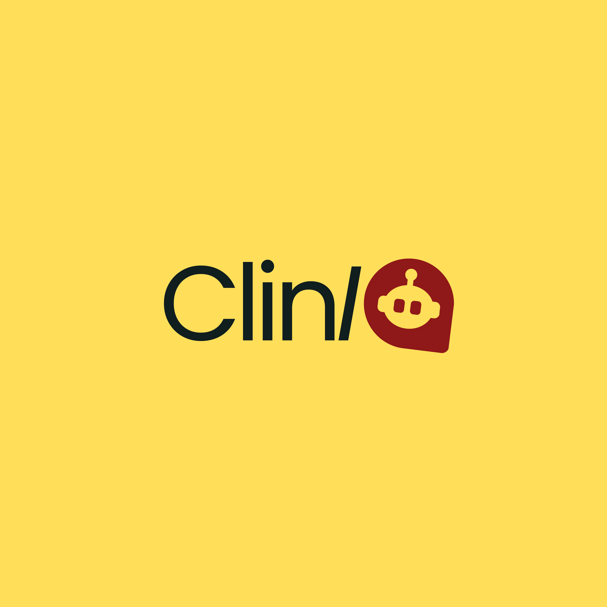
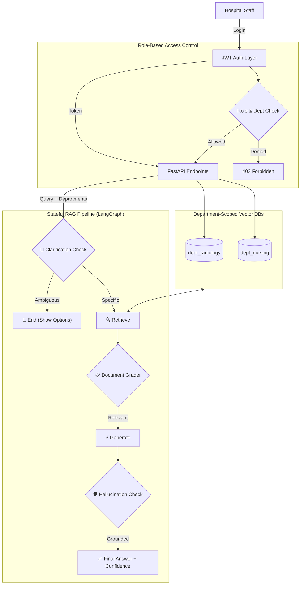

<div align="center">
  
  <h1>ClinIQ — Enterprise Healthcare RAG & Clinical UI</h1>
  <p><em>A production-ready, HIPAA-compliant AI knowledge system built for velocity, safety, and scale.</em></p>
</div>

---

## 🌟 The Product Vision

ClinIQ isn't just a wrapper around an LLM; it's a **secure, stateful clinical reasoning engine**. Designed for small-to-mid-size hospitals, ClinIQ bridges the gap between deep technical RAG orchestration and a highly polished, clinical-grade user experience. 

Whether you are a **Hospital Administrator** looking to streamline protocols, a **Clinician** needing rapid, grounded answers, or an **Engineering Leader** evaluating architectural rigor, ClinIQ demonstrates how modern AI ("vibe coding" executed with architectural discipline) delivers immediate enterprise value.

---

## 🏥 For Clinical & Business Leaders

**Why ClinIQ?**
When building for healthcare, "good enough" AI is dangerous. You need absolute, verifiable control.
*   **Zero Hallucination Tolerance:** Every answer is hard-checked against retrieved medical documents. If an answer isn't grounded, it's flagged or blocked.
*   **Role-Based Access Control (RBAC) & Data Redaction:** A built-in visual redaction engine hides PHI (Protected Health Information) mid-sentence if a user lacks the clearance (e.g., Doctors see vitals; billing admins see `[REDACTED]`).
*   **A "Clinical Precision" Interface:** Designed for noisy hospital wards. Features an asymmetric 70/30 layout for context retention and a custom **Web Audio Push-to-Talk** system requiring a continuous hold to prevent ambient PHI audio leaks.

---

## 🚀 Key Features

### 🤖 Stateful RAG Pipeline (LangGraph)
*   **Clarification Node**: Detects ambiguous clinical queries using a structured LLM before retrieval. Short-circuits the pipeline to ask specific follow-up questions.
*   **Document & Hallucination Graders**: LLM-based relevance checks tuned for clinical terminology and patient safety.
*   **Stateful Retries**: If no relevant documents are found, the pipeline rewrites the query (expanding medical abbreviations) and retries.

### 🔐 Authentication & Access Control
*   **JWT-Based Authentication & Role Hierarchy**: `Admin` → `Doctor` → `Nurse` → `Technician`.
*   **Department-Scoped Vector DBs**: Data isolation enforced at both the API and ChromaDB layer.

### 💎 Clinical-Grade UI (Next.js)
*   **Asymmetric 70/30 Layout**: Context Drawer (left) and Primary Chat Stream (right).
*   **Inline PHI Masking**: Dynamic UI redaction blocks for unauthorized data.
*   **Interactive Clarification Cards**: Renders inline buttons for RAG ambiguities.

---

## 🏗️ System Architecture


```mermaid
graph TD
    User["Hospital Staff"] -->|Login| Auth["JWT Auth Layer"]
    Auth -->|Token| API["FastAPI Endpoints"]

    subgraph RBAC ["Role-Based Access Control"]
        Auth --> RoleCheck{"Role & Dept Check"}
        RoleCheck -->|Allowed| API
        RoleCheck -->|Denied| Reject["403 Forbidden"]
    end

    subgraph VectorDBs ["Department-Scoped Vector DBs"]
        API --> DB1[("dept_radiology")]
        API --> DB2[("dept_nursing")]
    end

    subgraph RetrievalGraph ["Stateful RAG Pipeline (LangGraph)"]
        API -->|"Query + Departments"| ClarCheck{"🤔 Clarification Check"}
        ClarCheck -->|Ambiguous| ClarEnd["🏁 End (Show Options)"]
        ClarCheck -->|Specific| Retriever["🔍 Retrieve"]
        Retriever --> Grader{"📋 Document Grader"}
        Grader -->|Relevant| Generator["⚡ Generate"]
        Generator --> HalCheck{"🛡️ Hallucination Check"}
        HalCheck -->|Grounded| Response["✅ Final Answer + Confidence"]
    end

    VectorDBs <--> Retriever
```

## 🛠️ Tech Stack

| Layer | Technology |
|-------|-----------|
| **Frontend** | React, Next.js 14 (App Router), Tailwind CSS v4, Zustand |
| **Backend** | Python 3.10+, FastAPI, Uvicorn |
| **Orchestration** | LangChain ≥0.3, LangGraph ≥0.2 (stateful RAG) |
| **Observability** | LangSmith ≥0.2 (tracing, feedback loops) |
| **Vector DB** | ChromaDB ≥0.5 (multi-collection) |

## 🏃‍♂️ How to Run Locally

### 1. Start the Backend API
```bash
cp .env.example .env
# Add OPENAI_API_KEY
uvicorn main:app --reload
```

### 2. Start the Frontend UI
```bash
cd frontend
npm install
npm run dev
```
UI available at `http://localhost:3000`.

---
*Built for the future of healthcare. Ready to ship.*
