# ClinIQ — Enterprise Healthcare RAG

A secure, multimodal Retrieval-Augmented Generation (RAG) system designed for small-to-mid-size hospitals. Features a **5-node stateful LangGraph pipeline** with healthcare guardrails, **LangSmith deep observability**, **department-scoped vector databases**, **JWT-based RBAC**, **multimodal ingestion** (PDF, DOCX, Excel, Images, DICOM), and **clinician feedback loops** — all deployable as a single-container application.

## 🚀 Key Features

### 🤖 Stateful RAG Pipeline (LangGraph)
*   **5-Node Graph**: `retrieve` → `grade_documents` → `generate` → `hallucination_check`, with `transform_query` for adaptive retries
*   **Document Grader**: LLM-based relevance check filters out irrelevant documents before generation — tuned for clinical terminology, ICD/CPT codes, and drug interactions
*   **Hallucination Grader**: Verifies every clinical claim in the answer is grounded in the retrieved context — critical for patient safety
*   **Stateful Retries**: If no relevant documents are found, the pipeline rewrites the query (expanding medical abbreviations, adding clinical synonyms) and retries — up to 3 attempts before graceful termination
*   **Role-Aware Generation**: Prompts adapt based on user role (doctors get full clinical detail, researchers get anonymized data)
*   **Hybrid Search**: Semantic (embeddings) + BM25 for better recall on medical terms/CPT codes

### Deep Observability (LangSmith)
*   **Full Trace Capture**: Every graph node, LLM call, and retriever invocation is recorded in LangSmith
*   **Custom Metadata & Tags**: Each trace carries `department`, `user_role`, and `user_id` — hospital admins can filter logs by clinical department
*   **Clinician Feedback Loops**: `POST /api/v1/feedback` endpoint lets doctors/nurses submit corrections against specific traces — the **gold standard** for healthcare AI observability
*   **Latency Tracking**: LangSmith dashboards surface slow queries on sensitive medical operations

### 🔐 Authentication & Access Control
*   **JWT-Based Authentication**: Secure login with bcrypt-hashed passwords and token-based sessions
*   **Role Hierarchy**: `Admin` → `Doctor` → `Nurse` → `Technician` → `Researcher` → `Viewer`
*   **Department-Scoped RBAC**: Each user is assigned departments they can access — data isolation is enforced at both the API and vector DB layer
*   **Admin Panel**: Create/delete users, assign roles and departments, view system stats

### 📊 Multi-Collection Vector Store
*   **One ChromaDB collection per department**: `radiology`, `pharmacy`, `administration`, `nursing`, `laboratory`, `emergency`, `cardiology`, `oncology`, `orthopedics`, `pediatrics`, `general`
*   **Complete data isolation**: A nurse with `[nursing, general]` access can never see radiology documents
*   **Fan-out search**: Queries search across all allowed departments and merge results intelligently
*   **Configurable**: Departments are defined in `.env` — hospitals plug in their own structure

### 🖼️ Multimodal Ingestion
*   **Documents**: PDF (Policies), DOCX (Procedures), Excel (Coverage Tables)
*   **Medical Images**: OCR text extraction via Tesseract for scanned documents, X-ray reports, lab results
*   **DICOM**: Metadata extraction (study description, modality, body part, institution)
*   **Table-Aware Chunking**: Excel rows preserve header context

### 💎 Premium Frontend
*   **Glassmorphism dark-mode design** with ambient lighting effects
*   **Login modal** with persistent JWT sessions
*   **Department-scoped uploads**: Select target department before uploading
*   **Department filter chips**: Choose which departments to search in the chat
*   **Image preview**: Thumbnail preview for medical image uploads
*   **Admin panel**: User management and per-department document stats
*   **Responsive**: Works on desktop and tablet

## 🏗️ Architecture

```mermaid
graph TD
    User["Hospital Staff"] -->|Login| Auth["JWT Auth Layer"]
    Auth -->|Token| API["FastAPI Endpoints"]

    subgraph RBAC ["Role-Based Access Control"]
        Auth --> RoleCheck{"Role & Dept Check"}
        RoleCheck -->|Allowed| API
        RoleCheck -->|Denied| Reject["403 Forbidden"]
    end

    subgraph IngestionPipeline ["Multimodal Ingestion"]
        Docs["Documents (PDF, DOCX, XLSX)"] --> Loader["Loader Factory"]
        Images["Images (PNG, JPG, TIFF)"] --> Loader
        DICOM["DICOM (.dcm)"] --> Loader
        Loader --> Parser["Parsers (OCR, PDF, Excel)"]
        Parser --> PII["PII Anonymizer (Presidio)"]
        PII --> Chunker["Chunker"]
        Chunker --> Embed["Embeddings (OpenAI)"]
    end

    subgraph VectorDBs ["Department-Scoped Vector DBs"]
        Embed --> DB1[("dept_radiology")]
        Embed --> DB2[("dept_pharmacy")]
        Embed --> DB3[("dept_nursing")]
        Embed --> DBn[("dept_...")]
    end

    subgraph RetrievalGraph ["Stateful RAG Pipeline (LangGraph)"]
        API -->|"Query + Departments"| Retriever["🔍 Retrieve"]
        Retriever --> Grader{"📋 Document Grader"}
        Grader -->|Relevant| Generator["⚡ Generate"]
        Grader -->|"No docs + retries left"| Transform["🔄 Transform Query"]
        Transform --> Retriever
        Grader -->|"No docs + retries exhausted"| Fallback["🏁 Graceful End"]
        Generator --> HalCheck{"🛡️ Hallucination Check"}
        HalCheck -->|Grounded| Response["✅ Final Answer"]
        HalCheck -->|Hallucinated| Generator
    end

    subgraph Observability ["LangSmith Observability"]
        API -->|"metadata & tags"| LS["LangSmith Traces"]
        LS --> Dashboard["Filter by dept / role / user"]
        API -->|"POST /feedback"| Feedback["Clinician Corrections"]
    end

    VectorDBs <--> Retriever
```



## 🛠️ Tech Stack

| Layer | Technology |
|-------|-----------|
| **Frontend** | HTML5, CSS3 (Glassmorphism), Vanilla JS, Marked.js |
| **Backend** | Python 3.10+, FastAPI, Uvicorn |
| **Auth** | PyJWT, passlib (bcrypt), SQLite user store |
| **Orchestration** | LangChain ≥0.3, LangGraph ≥0.2 (stateful RAG) |
| **Observability** | LangSmith ≥0.2 (tracing, feedback loops) |
| **Vector DB** | ChromaDB ≥0.5 (multi-collection) |
| **LLM** | OpenAI GPT-4o (via `langchain-openai`) |
| **Embeddings** | OpenAI text-embedding-3-small |
| **Search** | Hybrid (Semantic + BM25) |
| **PII** | Presidio Analyzer + Anonymizer |
| **Multimodal** | Pillow, pytesseract (OCR), pydicom |
| **Deployment** | Docker, Render |

## 🏃‍♂️ How to Run Locally

### Prerequisites
- Python 3.10+
- [Tesseract OCR](https://github.com/tesseract-ocr/tesseract) (for image text extraction)
- OpenAI API key
- LangSmith API key (optional, for observability)

### Setup

1.  **Clone the repository**
    ```bash
    git clone https://github.com/your-username/enterprise-healthcare-rag.git
    cd enterprise-healthcare-rag
    ```

2.  **Set up Environment**
    ```bash
    cp .env.example .env
    ```
    Edit `.env` and add your `OPENAI_API_KEY`. Customize `HOSPITAL_DEPARTMENTS` for your hospital.

    To enable LangSmith observability, also set:
    ```bash
    LANGCHAIN_TRACING_V2=true
    LANGCHAIN_ENDPOINT=https://api.smith.langchain.com
    LANGCHAIN_API_KEY=ls__your-langsmith-api-key
    LANGCHAIN_PROJECT=ClinIQ-Hospital-Beta
    ```

3.  **Install Dependencies**
    ```bash
    pip install -r requirements.txt
    python -m spacy download en_core_web_sm
    ```

4.  **Run the Server**
    ```bash
    python main.py
    ```
    The UI is at `http://localhost:8000`. Swagger docs at `http://localhost:8000/docs`.

5.  **Login**
    Default admin: `admin` / `admin123` (change in production!)

## 🔑 Configuration

All hospital-specific config lives in `.env`:

| Variable | Description | Default |
|----------|-------------|---------|
| `OPENAI_API_KEY` | Your OpenAI API key | required |
| `HOSPITAL_DEPARTMENTS` | Comma-separated list of departments | `radiology,pharmacy,...,general` |
| `JWT_SECRET_KEY` | Secret for JWT signing | change in prod! |
| `JWT_EXPIRY_MINUTES` | Token expiry (minutes) | `480` (8 hours) |
| `USERS_DB_PATH` | Path to SQLite user database | `./data/users.db` |
| `LLM_MODEL` | OpenAI model name | `gpt-4o` |
| `MAX_QUERY_RETRIES` | Max query transform retries | `3` |
| `LANGCHAIN_TRACING_V2` | Enable LangSmith tracing | `true` |
| `LANGCHAIN_API_KEY` | LangSmith API key | optional |
| `LANGCHAIN_PROJECT` | LangSmith project name | `ClinIQ-Hospital-Beta` |

## 👥 Roles & Permissions

| Role | Access Level | Default Departments |
|------|-------------|-------------------|
| **Admin** | Full system access, user management | All |
| **Doctor** | Full clinical data, PII de-anonymization | All |
| **Nurse** | Care protocols and procedures | nursing, general, emergency |
| **Technician** | Technical procedures and safety | laboratory, radiology |
| **Researcher** | Anonymized aggregate data | general |
| **Viewer** | High-level policy summaries | general |

## 📡 API Endpoints

| Method | Endpoint | Auth | Description |
|--------|----------|------|-------------|
| POST | `/api/v1/auth/login` | ❌ | Login, returns JWT |
| POST | `/api/v1/auth/register` | Admin | Create user |
| GET | `/api/v1/auth/me` | ✅ | Current user profile |
| POST | `/api/v1/ingest` | ✅ | Upload doc to department |
| POST | `/api/v1/query` | ✅ | Query with dept filtering |
| POST | `/api/v1/feedback` | ✅ | Submit clinician feedback to LangSmith |
| GET | `/api/v1/departments` | ✅ | User's accessible depts |
| GET | `/api/v1/departments/stats` | Admin | Doc counts per dept |
| GET | `/api/v1/admin/users` | Admin | List all users |
| DELETE | `/api/v1/admin/users/{username}` | Admin | Delete user |

## 🔒 Security & Healthcare Considerations

*   **Department Isolation**: Vector DB collections are physically separated per department. RBAC is enforced at the API layer AND the retrieval layer.
*   **PII Protection**: All ingested text is automatically anonymized via Presidio. Only `doctor` role can de-anonymize.
*   **No PHI Storage by Design**: This system is for Knowledge Base data (policies, SOPs), not patient records.
*   **Healthcare Guardrails**: Document grading filters irrelevant context; hallucination grading ensures clinical accuracy; generation prompts forbid ungrounded medical advice.
*   **Audit Trail**: User IDs, query transformations, and full LangSmith traces provide complete traceability for compliance.
