# ClinIQ — Enterprise Healthcare RAG

A secure, multimodal Retrieval-Augmented Generation (RAG) system designed for small-to-mid-size hospitals. Features a **6-node stateful LangGraph pipeline** with healthcare guardrails, **LangSmith deep observability**, **department-scoped vector databases**, **JWT-based RBAC**, **multimodal ingestion** (PDF, DOCX, Excel, Images, DICOM), **Claude-style clarification questions**, and **clinician feedback loops** — all deployable as a single-container application.

## 🚀 Key Features

### 🤖 Stateful RAG Pipeline (LangGraph)
*   **6-Node Graph**: `clarification_check` → `retrieve` → `grade_documents` → `generate` → `hallucination_check`, with `transform_query` for adaptive retries.
*   **Clarification Node**: Detects ambiguous clinical queries using a structured LLM before retrieval. Short-circuits the pipeline to ask specific follow-up questions instead of guessing.
*   **Document Grader**: LLM-based relevance check filters out irrelevant documents before generation — tuned for clinical terminology, ICD/CPT codes, and drug interactions.
*   **Hallucination Grader**: Verifies every clinical claim in the answer is grounded in the retrieved context — critical for patient safety.
*   **Stateful Retries**: If no relevant documents are found, the pipeline rewrites the query (expanding medical abbreviations, adding clinical synonyms) and retries — up to 3 attempts before graceful termination.
*   **Role-Aware Generation**: Prompts adapt based on user role (doctors get full clinical detail, researchers get anonymized data).
*   **Hybrid Search**: Semantic (embeddings) + BM25 for better recall on medical terms/CPT codes.

### 🎯 Clarification & Confidence Indicators
*   **Claude-Style Options**: When a query is ambiguous (e.g. "tell me about the policy"), ClinIQ provides 2–4 clickable card options to refine the search.
*   **Hallucination Score**: Each API response returns `hallucination_score` (`"yes"` = grounded, `"no"` = unverified) from the LangGraph pipeline.
*   **Confidence Score**: Computed as the average cosine similarity of the top-3 retrieved source chunks (0.0–1.0).
*   **Visual Panels**: Every AI response renders a **✓ Grounded** (emerald) or **⚠ Unverified** (amber) badge, an animated confidence bar (green/amber/red by tier), and a collapsible source list.

### Deep Observability (LangSmith)
*   **Full Trace Capture**: Every graph node, LLM call, and retriever invocation is recorded in LangSmith.
*   **Custom Metadata & Tags**: Each trace carries `department`, `user_role`, and `user_id` — hospital admins can filter logs by clinical department.
*   **Clinician Feedback Loops**: `POST /api/v1/feedback` endpoint lets doctors/nurses submit corrections against specific traces — the **gold standard** for healthcare AI observability.

### 🔐 Authentication & Access Control
*   **JWT-Based Authentication**: Secure login with bcrypt-hashed passwords and token-based sessions.
*   **Role Hierarchy**: `Admin` → `Doctor` → `Nurse` → `Technician` → `Researcher` → `Viewer`.
*   **Department-Scoped RBAC**: Each user is assigned departments they can access — data isolation is enforced at both the API and vector DB layer.

### 💎 Claude-Inspired UI
*   **Teal/emerald healthcare palette** with warm off-white background — clean, content-first aesthetic.
*   **Sidebar layout**: Department filter chips, per-session chat history, user avatar + role badge.
*   **Full-width AI messages**: No chat bubbles for responses — identical reading experience to Claude.
*   **Interactive Option Cards**: Clarification cards auto-fill the input and re-send the query on click.
*   **Knowledge Base drawer**: Slide-in right panel for file uploads (no page switching).

## 🏗️ Architecture

```mermaid
graph TD
    User["Hospital Staff"] -->|Login| Auth["JWT Auth Layer"]
    Auth -->|Token| API["FastAPI Endpoints"]

    subgraph RBAC ["Role-Based Access Control"]
        Auth --> RoleCheck{"Role & Dept Check"}
        RoleCheck -->|Allowed| API
        RoleCheck -->|Denied| Reject["403 Forbidden"]
    end

    subgraph IngestionPipeline ["Multimodal Ingestion"]
        Docs["Documents (PDF, DOCX, XLSX)"] --> Loader["Loader Factory"]
        Images["Images (PNG, JPG, TIFF)"] --> Loader
        DICOM["DICOM (.dcm)"] --> Loader
        Loader --> Parser["Parsers (OCR, PDF, Excel)"]
        Parser --> PII["PII Anonymizer (Presidio)"]
        PII --> Chunker["Chunker"]
        Chunker --> Embed["Embeddings (OpenAI)"]
    end

    subgraph VectorDBs ["Department-Scoped Vector DBs"]
        Embed --> DB1[("dept_radiology")]
        Embed --> DB2[("dept_pharmacy")]
        Embed --> DB3[("dept_nursing")]
        Embed --> DBn[("dept_...")]
    end

    subgraph RetrievalGraph ["Stateful RAG Pipeline (LangGraph)"]
        API -->|"Query + Departments"| ClarCheck{"🤔 Clarification Check"}
        ClarCheck -->|Ambiguous| ClarEnd["🏁 End (Show Options)"]
        ClarCheck -->|Specific| Retriever["🔍 Retrieve"]
        Retriever --> Grader{"📋 Document Grader"}
        Grader -->|Relevant| Generator["⚡ Generate"]
        Grader -->|"No docs + retries left"| Transform["🔄 Transform Query"]
        Transform --> Retriever
        Grader -->|"No docs + retries exhausted"| Fallback["🏁 Graceful End"]
        Generator --> HalCheck{"🛡️ Hallucination Check"}
        HalCheck -->|Grounded| Response["✅ Final Answer + Confidence"]
        HalCheck -->|Hallucinated| Generator
    end

    subgraph Observability ["LangSmith Observability"]
        API -->|"metadata & tags"| LS["LangSmith Traces"]
        LS --> Dashboard["Filter by dept / role / user"]
        API -->|"POST /feedback"| Feedback["Clinician Corrections"]
    end

    VectorDBs <--> Retriever
```



## 🛠️ Tech Stack

| Layer | Technology |
|-------|-----------|
| **Frontend** | HTML5, CSS3 (Claude-inspired layout), Vanilla JS, Marked.js |
| **Backend** | Python 3.10+, FastAPI, Uvicorn |
| **Auth** | PyJWT, passlib (bcrypt), SQLite user store |
| **Orchestration** | LangChain ≥0.3, LangGraph ≥0.2 (stateful RAG) |
| **Observability** | LangSmith ≥0.2 (tracing, feedback loops) |
| **Vector DB** | ChromaDB ≥0.5 (multi-collection) |
| **LLM** | OpenAI GPT-4o (via `langchain-openai`) |
| **Embeddings** | OpenAI text-embedding-3-small |

## 🏃‍♂️ How to Run Locally

### Prerequisites
- Python 3.10+
- [Tesseract OCR](https://github.com/tesseract-ocr/tesseract)
- OpenAI API key
- LangSmith API key (optional)

### Setup

1.  **Clone & Install**
    ```bash
    git clone https://github.com/your-username/enterprise-healthcare-rag.git
    pip install -r requirements.txt
    ```

2.  **Environment**
    ```bash
    cp .env.example .env
    # Add OPENAI_API_KEY
    ```

3.  **Run**
    ```bash
    uvicorn main:app --reload
    ```
    UI at `http://localhost:8000`. Default admin: `admin` / `admin123`.

## 🎯 Clarification Options

Every AI response includes a confidence panel, but **ambiguous queries** trigger a special clarification flow:

| Scenario | UI Response |
|----------|-------------|
| **Ambiguous** (e.g., "medication info") | Shows 2–4 clickable cards with specific follow-up questions. |
| **Specific** (e.g., "prior auth for knee MRI") | Runs the full RAG pipeline and returns a grounded answer. |

The API returns `response_type="clarification"` and an `options` list in these cases.

## 👥 Roles & Permissions

| Role | Access Level |
|------|-------------|
| **Admin** | Full system access, user management |
| **Doctor** | Full clinical data, PII de-anonymization |
| **Nurse** | Care protocols (nursing, general, emergency) |
| **Technician** | Technical procedures (laboratory, radiology) |

## 📡 Key API Endpoints

| Method | Endpoint | Description |
|--------|----------|-------------|
| POST | `/api/v1/auth/login` | Returns JWT |
| POST | `/api/v1/query` | Returns answer OR clarification options |
| POST | `/api/v1/ingest` | Upload document to specific department |
| POST | `/api/v1/feedback` | Clinician corrections to LangSmith |
